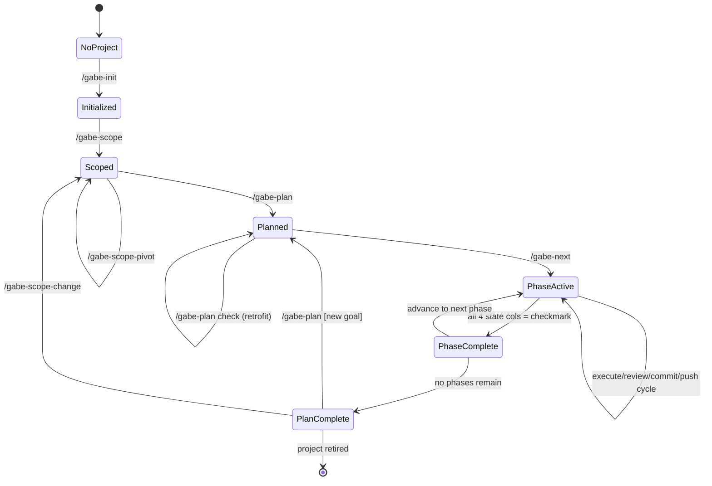
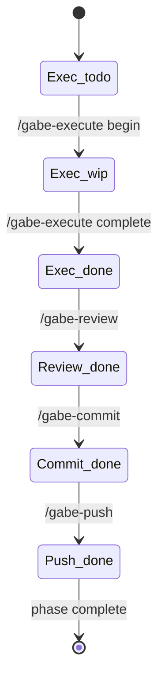
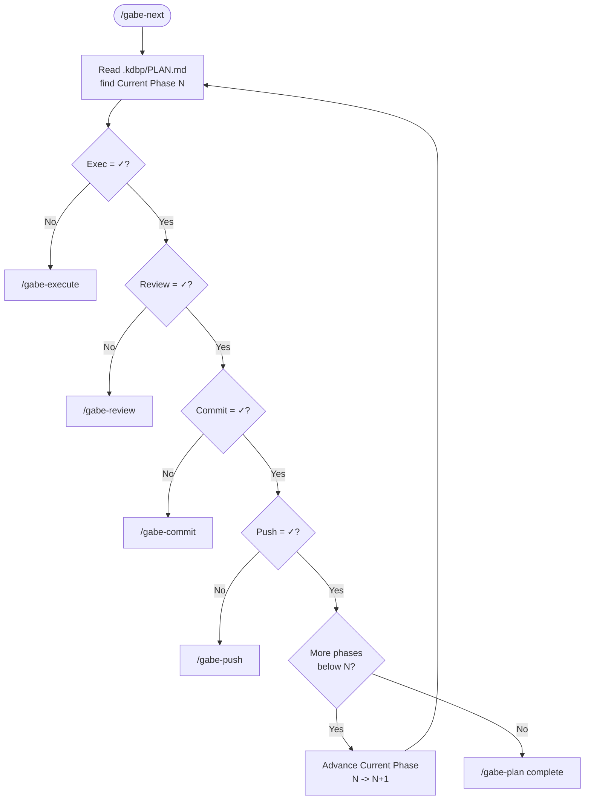
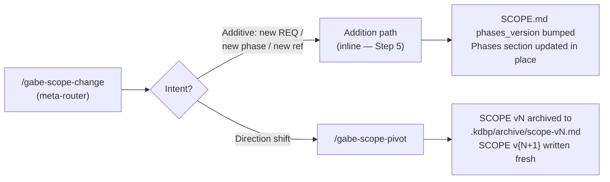

# Gabe Suite — Workflow & State Machine

**Audience:** anyone using the Gabe Suite to build a project.
**Purpose:** single source of truth for how the commands connect, what state they read/write, and when to run each one.

This doc is the map. For depth on any single piece, follow the links to `architecture/` or to the skill's own spec under `skills/<name>/` (core in SKILL.md, binding spec in `references/`). For project starts, use [workflows/greenfield.md](workflows/greenfield.md) for new apps and [workflows/brownfield.md](workflows/brownfield.md) for existing codebases.

---

## TL;DR — the shape

Three layers:

1. **User-level setup** — once per machine (cognitive profile, user values)
2. **Project setup** — once per project (init, scope, plan)
3. **Phase execution loop** — repeats per phase until plan is complete

The suite is **serial** by design (post-rollback): one active plan at a time, phases run in order, no parallel lanes. The primary router is `/gabe-next` — it reads `.kdbp/PLAN.md` state and dispatches to the next command.

For complex planning work, `/gabe-plan` can create a self-contained HTML review artifact as the human entrypoint. The artifact is useful for phase maps, ownership diagrams, workflow traces, and risk summaries, but it is not canonical state: `.kdbp/PLAN.md`, `.kdbp/DECISIONS.md`, and `.kdbp/LEDGER.md` remain the source of truth. Each complex HTML artifact should also include a visible detail-link section that points to the Markdown/README files where deeper implementation details live.

---

## Project-start modes

| Mode | Use when | First command | Guide |
|------|----------|---------------|-------|
| Greenfield | You are starting from an idea or empty repo | `/gabe-align deep "<idea>"` | [workflows/greenfield.md](workflows/greenfield.md) |
| Brownfield | You are adopting an existing codebase | read-only inventory first | [workflows/brownfield.md](workflows/brownfield.md) |
| Active KDBP | `.kdbp/PLAN.md` already exists | `/gabe-help`, then `/gabe-next` | this doc |

Architecture Principles AP1-AP13 are advisory checks inside `/gabe-align`, `/gabe-debt`, and `/gabe-review`. They provide `CONCERN`/review/debt context; they do not block phase execution by themselves.

---

## Project lifecycle — high-level state machine



States are **files + flags**, not abstract. See [File surface](#file-surface) for where each state lives.

---

## Per-phase state — four columns

Every phase in `PLAN.md` has four state columns. Transitions are driven by one command each.



Column legend:

| Column | Emoji | Meaning | Written by |
|--------|-------|---------|-----------|
| Exec | ⬜ → 🔄 → ✅ | implementation state | `/gabe-execute` |
| Review | ⬜ → ✅ | risk-priced review done | `/gabe-review` |
| Commit | ⬜ → ✅ | quality gate passed + git commit | `/gabe-commit` |
| Push | ⬜ → ✅ | pushed + PR + CI + bookkeeping | `/gabe-push` |

A phase is **complete** only when all four columns are ✅.

---

## `/gabe-next` dispatch logic

The router is deterministic — zero LLM calls. It reads `.kdbp/PLAN.md`, finds the current phase, and applies this decision table:



`/gabe-next` writes only one thing: the `## Current Phase` line in `PLAN.md` when it advances `N → N+1`. No other state mutation.

---

## Scope evolution paths

SCOPE.md — including its `## Phases` section, which holds the phase arc — is written by the `/gabe-scope` family only. No other command edits it. The family branches by intent:



Direct entry points: `/gabe-scope-pivot` can be invoked directly when you already know it's a pivot. Additions always run inside `/gabe-scope-change` (its Step 5 — use `--force-addition` to skip the classifier); the former standalone `gabe-scope-addition` skill is archived — see `skills/_archive/`.

---

## Commands — full catalog

### Core flow (happy path)

| Command | When | Reads | Writes | LLM? |
|---------|------|-------|--------|------|
| `/gabe-init [name]` | project setup (once) | project dir | `.kdbp/` + `CLAUDE.md` + hooks | yes (interview) |
| `/gabe-scope` | after init, before plan | existing refs | `SCOPE.md` (incl. `## Phases`), `scope-references.yaml`, tombstones | yes |
| `/gabe-plan [goal]` | after scope | `SCOPE.md` (incl. `## Phases`), `VALUES.md` | `PLAN.md`, `PLAN.json`, `DECISIONS.md`, optional HTML review artifact | yes |
| `/gabe-next` | every phase step | `PLAN.md` | `PLAN.md` (Current Phase advance only) | **no** |
| `/gabe-execute` | phase has Exec=⬜/🔄 | `PLAN.md`, `STRUCTURE.md` | code + `PLAN.md` Exec col + `PLAN.json` proof field + `PENDING.md` (maybe) | yes |
| `/gabe-review` | phase has Exec=✅, Review=⬜ | git diff, `PLAN.md`, `VALUES.md`, tier sections | `PLAN.md` Review col + `PENDING.md` (maybe) | yes |
| `/gabe-commit [msg]` | phase has Review=✅, Commit=⬜ | git staged, `DOCS.md`, `STRUCTURE.md` | git commit, `LEDGER.md`, `PLAN.md` Commit col | deterministic + targeted LLM |
| `/gabe-push` | phase has Commit=✅, Push=⬜ | git, `PUSH.md`, `DEPLOYMENTS.md` | remote, PR, `PLAN.md` Push col, `DEPLOYMENTS.md`, `LEDGER.md` | minimal |

### Scope family

| Command | When | Writes |
|---------|------|--------|
| `/gabe-scope-change` | any scope evolution (entry point) | classifies; additions execute INLINE — `SCOPE.md` (`phases_version` bump, `## Phases` updated in place), `scope-references.yaml`; pivots route to `-pivot` |
| `/gabe-scope-pivot` | direction change (or routed from `-change`) | archives vN, writes v{N+1} |

### Plan family

| Command | When | Writes |
|---------|------|--------|
| `/gabe-plan` | after scope (creates plan) | `PLAN.md`, `DECISIONS.md`, optional `docs/gabe/plans/.../index.html` |
| `/gabe-plan check` | existing plan predates spec change | `PLAN.md` retrofit, `DECISIONS.md` backfill |
| `/gabe-plan complete` | all phases ✅ (called by `/gabe-next`) | archives `PLAN.md` → `.kdbp/archive/completed_*.md` |

### Cross-cutting (any time)

| Command | Purpose |
|---------|---------|
| `/gabe-help` | context-aware "what should I do next?" — read-only scan |
| `/gabe-align [depth]` | values check + checkpoint (shallow / standard / deep) |
| `/gabe-assess [change]` | blast radius + maturity scope + prerequisites for a proposed change |
| `/gabe-roast [perspective] [target]` | adversarial gap review from a specific viewpoint |
| `/gabe-health [focus]` | codebase structural health — god files, churn, coupling, bugs |
| `/gabe-debt [brief\|dry-run\|target]` | architecture decision-debt scan with AP evidence citations |
| `/gabe-mockup [mode]` | mockup, React Storybook, and design-reference workflows |
| `/gabe-lens [concept]` | cognitive translation — analogies, constraint boxes, Gabe Blocks |

---

## File surface — `.kdbp/` per-project state

All project state lives under `.kdbp/` at the project root. Flat layout — no subdirectories for active state (only `archive/`, `research/`).

| File | Purpose | Who writes | Shape |
|------|---------|-----------|-------|
| `BEHAVIOR.md` | project identity + maturity + stack + mockup manifest | `/gabe-init` | prose + frontmatter |
| `VALUES.md` | project values (cross-stack: `~/.kdbp/VALUES.md`) | `/gabe-init`, `/gabe-align evolve` | prose |
| `SCOPE.md` | REQs + reference frame + pillars + phase arc (`## Phases`) | `/gabe-scope` family | structured sections + frontmatter |
| `scope-references.yaml` | reference frame refs | `/gabe-scope` family | YAML |
| `PLAN.md` | **active plan** — Phases table + Phase Details | `/gabe-plan`, `/gabe-next`, `/gabe-execute`, `/gabe-review`, `/gabe-commit`, `/gabe-push` (column ticks) | markdown table + YAML per phase |
| `PLAN.json` | machine mirror of `PLAN.md` — phases, cells, tier, per-phase `proof` field | `/gabe-plan`, auto-tick helper, `/gabe-execute` (proof field) | JSON |
| `DECISIONS.md` | ADR log — one entry per phase tier decision + operational decisions | `/gabe-plan`, `/gabe-scope`, `/gabe-push` (operational classifier) | numbered sections |
| `STRUCTURE.md` | folder pattern conventions | `/gabe-init`, manual | pattern list |
| `DOCS.md` | source → doc drift map | `/gabe-commit docs-audit` | mapping table |
| `DEPLOYMENTS.md` | per-phase push/deploy bookkeeping | `/gabe-push` | table per phase |
| `PUSH.md` | remote + strategy config | `/gabe-push` (first run) | yaml-ish |
| `PENDING.md` | deferred findings | `/gabe-review`, `/gabe-commit`, `/gabe-roast`, `/gabe-health` | table |
| `LEDGER.md` | thin session index — one row per command checkpoint | `/gabe-plan`, `/gabe-execute`, `/gabe-commit`, `/gabe-review`, `/gabe-push`, `/gabe-handoff` (+ SCOPE/ALIGN/TEACH/MOCKUP satellite tags) | append-only table |
| `CHANGES.jsonl` | structured event log | all commands that emit events | JSON lines |
| `archive/` | archived plans + scope tombstones + retired legacy files (`retired/`) | `/gabe-plan complete`, `/gabe-scope-pivot` | nested files |
| `research/` | scope research artifacts | `/gabe-scope` step 8 | nested files |

User-level (cross-project):

| File | Purpose |
|------|---------|
| `~/.kdbp/VALUES.md` | user values, override project defaults |
| `~/.claude/gabe-lens-profile.md` | cognitive suit for `/gabe-lens` |

---

## Invariants (what must always be true)

1. **No raw commits.** All commits via `/gabe-commit`. Raw `git commit` bypasses CHECK 1–9 + deferred scan + doc drift + Notable Updates digest.
2. **PLAN before code.** `/gabe-execute` reads `.kdbp/PLAN.md` state column before implementing. No implementation without a phase row.
3. **STRUCTURE before placement.** New files must match a pattern in `.kdbp/STRUCTURE.md`. PostToolUse hook warns on drift; CHECK 9 escalates at commit.
4. **VALUES override defaults.** Project `.kdbp/VALUES.md` + user `~/.kdbp/VALUES.md` outrank model priors. `/gabe-align` audits.
5. **Verified KNOWLEDGE topics trump re-derivation, when present.** `.kdbp/KNOWLEDGE.md` is legacy-only — no live command creates one (the `gabe-teach` skill that owned this is archived, see `skills/_archive/`), but if a project still has one and it marks a topic `verified`, honor that explanation rather than re-deriving.
6. **SCOPE.md writes only by the `/gabe-scope` family.** That includes its `## Phases` section. `/gabe-commit` warns on direct edits.
7. **`/gabe-next` is read-only except for `## Current Phase` advancement.** No other state mutation. Zero LLM.

---

## Common scenarios

### Scenario 1 — greenfield project, first plan

```text
user: /gabe-align deep "idea for the app"
  -> values, scenarios, and AP1-AP13 concerns surfaced before setup
user: /gabe-init my-project
  -> .kdbp/ scaffolded, CLAUDE.md at root
user: /gabe-scope
  -> SCOPE.md v1 written (incl. `## Phases`)
user: /gabe-plan "build the foundation"
  -> PLAN.md written with 6 phases, DECISIONS D1-D6 logged
user: /gabe-next
  -> dispatches to /gabe-execute (Phase 1, Exec=⬜)
... phase completes across /gabe-execute, /gabe-review, /gabe-commit, /gabe-push
user: /gabe-next (loop until all phases done)
```

### Scenario 2 — brownfield adoption

```text
user: inspect repo layout, tests, CI, docs, and git history without modifying files
  -> inventory confirms whether .kdbp/ exists and what the adoption risk is
user: /gabe-init update
  -> refreshes existing KDBP state when .kdbp/ is already present
  OR
user: /gabe-init existing-project
  -> starts a cautious KDBP baseline when no .kdbp/ exists
user: /gabe-health
  -> maps structural hotspots before planning changes
user: /gabe-debt brief
  -> records evidence-backed decision debt and AP concerns
user: /gabe-plan check
  -> verifies active plan mappings when a plan already exists
```

See [workflows/brownfield.md](workflows/brownfield.md) for the full adoption order.

### Scenario 3 — continuing existing KDBP project

```text
user: /gabe-help
  -> dashboard shows: "Phase 3 — Review pending"
user: /gabe-next
  -> dispatches to /gabe-review
```

### Scenario 4 — scope evolved mid-plan

```text
user: realizes new REQ needed
user: /gabe-scope-change "add REQ-28 for jurisdiction support"
  -> classifier: addition — executes inline (Step 5)
  -> SCOPE phases_version bumped, new REQ appended
user: /gabe-plan check
  -> flags PLAN.md phases that now need a new REQ mapping
user: retrofit or start new plan
```

### Scenario 5 — plan complete

```text
user: /gabe-next
  -> detects all phases ✅, dispatches to /gabe-plan complete
  -> PLAN.md archived to .kdbp/archive/completed_<name>.md
user: /gabe-plan "next milestone goal" (new plan)
  OR
user: /gabe-scope-change (scope evolution)
```

### Scenario 6 — hotfix / out-of-band

Not natively supported at time of writing. See [GAPS.md](GAPS.md) gap W4 for options.

---

## Anti-patterns (what breaks the model)

| Anti-pattern | Why it breaks | Fix |
|--------------|---------------|-----|
| Raw `git commit` | Bypasses CHECK 1–9 + deferred scan + doc drift + invariant 1 | Always `/gabe-commit` |
| Editing `PLAN.md` state columns manually | Commands become source-of-truth mismatch | Use `/gabe-execute`, `/gabe-review`, `/gabe-commit`, `/gabe-push` |
| Editing `SCOPE.md` directly | Invariant 6; `/gabe-commit` warns | Use `/gabe-scope-change` (additions inline; pivots route to `/gabe-scope-pivot`) |
| Skipping `/gabe-review` between execute and commit | Tier-drift + risk pricing never runs | Always run `/gabe-review` |
| Running commands on `.kdbp/lanes/<lane>/` paths | Lane layout retired; those paths don't exist | Use root `.kdbp/*.md` |
| Creating `.worktrees/` directories | Lane feature retired | Serial plan only |

---

## Related docs

- **[GAPS.md](GAPS.md)** — remaining workflow gaps + options to close each
- **[workflows/README.md](workflows/README.md)** — quick chooser for greenfield, brownfield, and active KDBP starts
- **[workflows/greenfield.md](workflows/greenfield.md)** — idea-to-first-phase flow for new apps
- **[workflows/brownfield.md](workflows/brownfield.md)** — adoption guide for existing codebases
- **[suite-state-audit.md](suite-state-audit.md)** — current suite inventory, install state, and known documentation gaps
- **[architecture/stack.md](architecture/stack.md)** — recommended application stack for projects built with the suite
- **[architecture/scope-data-contracts.md](architecture/scope-data-contracts.md)** — authoritative field-by-field contract for SCOPE.md (incl. its `## Phases` section) + scope-references
- **[architecture/diagram-standards.md](architecture/diagram-standards.md)** — diagram conventions for docs in this repo
- **[architecture/requirements.md](architecture/requirements.md)** — suite-level design requirements + non-goals
- **[archive/](archive/)** — retired dogfood + historical design docs
- Runtime specs: `skills/gabe-*/SKILL.md` + `skills/gabe-*/references/*.md`
- Templates: `templates/`
