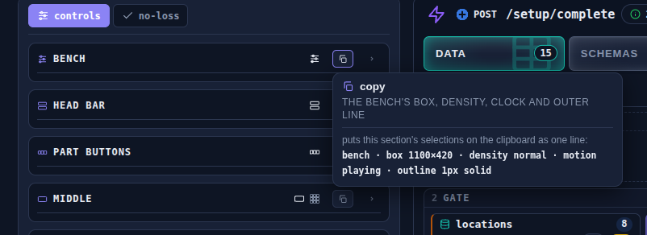
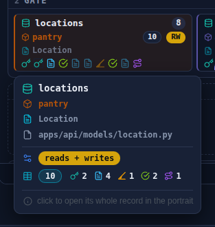
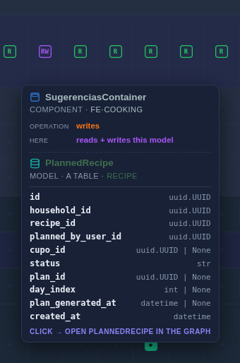
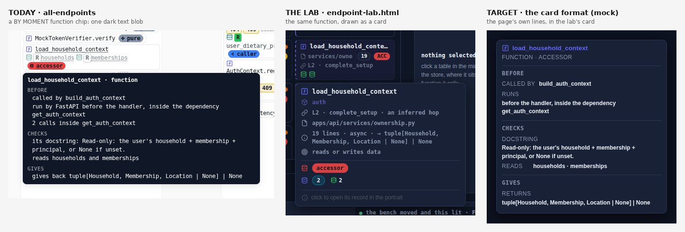
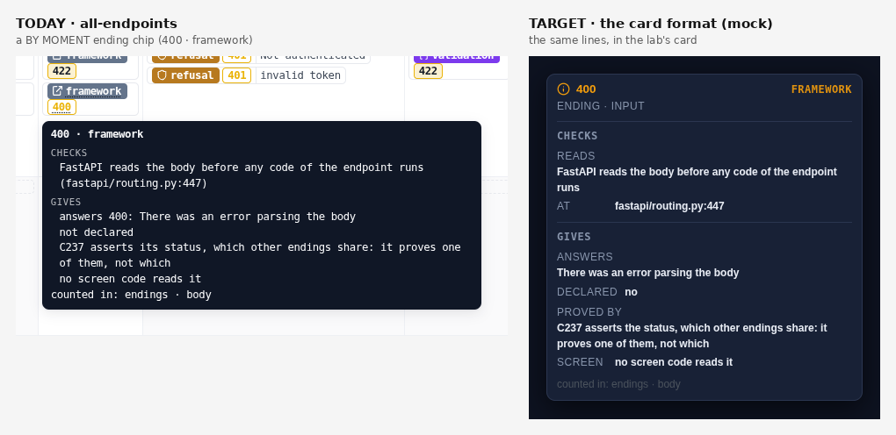
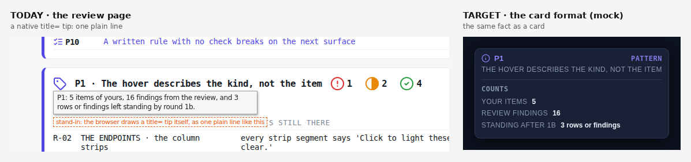

# Hover cards, one emitter, and two redrafts — design note (L-33 · D-085 · P2.1 · P3.2) — DRAFT, nothing lands before his "land it"

Written 2026-10-02 on `graft-adoption` (HEAD `9a9bb86`). Read-only on every page and generator; this folder is the only thing written. Every number was measured the same day on the working tree (gustify @ `05007957`, 80 endpoints; the all-endpoints files carry another lane's uncommitted edits, and every counted item was identical at HEAD and in the tree). A line that is my reading rather than a count says so.

## In short

1. **The hover he likes is the endpoint lab's card** — `workflow-panel/endpoint-lab.html`, the `#hover` card, on the left rail's controls and on the bench's blocks. It is the Gabe Universe station's journey-matrix popover (2026-09-03), carried into the lab on 2026-09-11, given a law the same day, and made to mirror its block on 2026-09-13. Confidence: about 85% that this is the surface he means; the format itself is certain.
2. **No other page uses it, and no gate asks for it.** all-endpoints draws a dark text box of its own (since `3b9c3be`, 2026-09-22). The review page draws the browser's native `title` line, 1,676 of them. The card law lives in a design page (the Panel Pattern Book, D-027), not in any skill or check.
3. **One emitter per page.** `card(kind, element, fields)` draws the lab's card and runs the rules of that kind as the card is made. Today's `io_of` is already a one-builder start for 7,236 item hovers. Measured cost is in section 2.
4. **Unknown kinds are kept, not named.** A generic "unknown" card, a counted file, a batch tool later.
5. **Three things are his to rule** (end of this note): the repeated plain line on element cards, each kind's layout (the bench, D-083), and whether the review page joins now.

---

## 1 · L-33 — where the lab's hover cards came from, and what they are

**Answer.** They are one card system, `#hover` in `endpoint-lab.html`, drawn by three builders: `card()` (120 call sites in `_lab-ep-panels.js`), `hcard()` (the card law; 94 call sites, 77 in the page and 17 in the panels) and `blockCard()` (the mirror card for a drawn block). The format was born in the Gabe Universe station on 2026-09-03 and the lab lifted it on 2026-09-11.

### 1.1 Which surface — and what else fits

| | surface | what it is | fit |
|---|---|---|---|
| **A** | `endpoint-lab.html`, **left rail** | every rail control opens a short card: glyph + bold title, an uppercase kind line, a rule, one body | matches "on the left, in the endpoint" literally (the rail is the left column) |
| **B** | `endpoint-lab.html`, **bench blocks** | the mirror card: glyph, ink name, entity, class, file, the channel chip, the field pill, marks, a quiet footer | matches "beautiful, informative, easier to read" best |
| C | Gabe Universe station, journey matrix | the popover the lab copied (`_jdCellPop`) | the same format, one step back; shown as the origin |

I name **A + B** (one system) at about 85%. If he meant the station's own popover, the answer is the same format and the same trace.

Pictures (headless Chrome, real hovers):

| left rail control (A) | data block (B) | the origin, in the station (C) |
|---|---|---|
|  |  |  |

More from the lab: [a function card](shots/lab-function-card.png) · [a test case card](shots/lab-test-card.png).

### 1.2 Where it came from — the trace

| date | commit | what it added | his words or ruling, as recorded |
|---|---|---|---|
| 2026-09-03 | `51b84a2` | station journey matrix: hover a structure → a popover window "styled like the component-class info": kind · entity · all fields, "click → open in the graph" | the field window he asked for as his item #10 (the commit message) |
| 2026-09-03 | `3356fa0` | one positioner (`_jdPop`) for every popover; from/to popovers; ⓘ header popovers | — |
| 2026-09-03 | `71f1eac` | `_jdCellPop`: the step (element · kind · entity · operation · role) · a rule · the structure (kind · entity · fields) · "click →"; fonts +1.5 px | operator feedback pass |
| 2026-09-11 | `388a460` | **the lab lifts the station's card chrome** (`STATION.CARDCSS`, the `.jdcolpop` frame) and builds every hover "in the station's `_jdCellPop` shape" | "The icons, colors, shapes, and theme should be more aligned with what we have in the Gabe universe" (`ep-brief.md`) |
| 2026-09-11 | `5fbdce1` | the plain line, lifted from the legend reference | "especially when we hover over an element" |
| 2026-09-11 | `1365741` | **the card law**: the thing and its value · the factors as a list · this element's own fields · a rule · the plain line last | "this will determine a lot of things for all the other hover windows" |
| 2026-09-13 | `c525fcf` | **the block card mirrors the block**: its glyph colour, ink name, entity, class, file, channel chip, field pill, marks, a quiet footer | "consolidate the hover only to show the hover that we are showing for the whole table" |
| 2026-09-13 | `559b8d7` | the Panel Pattern Book: "a card mirrors its thing", "one hover per drawn element", "icons are the labels" (D-027, backfilled 2026-09-22) | — |

Rules that shaped it: D-009 (three depths: a control's hover is very short; an element's is a detail card), D-017 (what the code does is shown, how the map knows it is not), D-027 (the card law and the mirror card), D-067 (one hover per item; the kind's meaning goes to a legend), D-081 P1.1 (repeat only a short label).

### 1.3 Why it never reached the other pages

all-endpoints.html was born on 2026-09-22 (`3b9c3be`, D-024) as a kit page with its own `#tip` — "short on a control, richer on an element". The review page has no hover system of its own; it sets `title=`. Nothing carried the card law across: a search of `skills/` and `templates/` finds the card only inside the station itself — no rule, reference or check names it as the hover format. That is the gap L-33 asks the gates to close.

### 1.4 The format, as a spec a generator can follow

Parts, top to bottom (the card law, D-027, with the mirror card's changes; the pictures in 1.1 show them):

| # | part | spec (measured in the lab) |
|---|---|---|
| 1 | **head** | the thing's own glyph (15 px; 16 on the block card) in the kind's colour · its name, 13.5 px, weight 800 (ink on a block card, the kind's colour on a control card) · optionally a **value** at the right edge, 12 px uppercase mono — the value that diagnoses it (`FRAMEWORK`, `200`) |
| 2 | **kind line** | 12 px uppercase, muted: kind · entity (`COMPONENT · FE·COOKING`). States the kind once, short |
| 3 | condition *(only where there is one)* | one muted line saying what the condition is |
| 4 | factors *(only for a diagnosed thing)* | a list, never a squeezed table: name · value · threshold · a quiet note; the one that fires has a red rail, the others stay in full ink |
| 5 | **rows** | label left (12 px uppercase muted, 58 px minimum) · value right (12 px bold ink). A value over 30 characters drops under its label, full width. A value may wear a colour: the kind's, read/write, a state |
| 6 | marks | the thing's own chip and pill, as drawn (`reads + writes`, the field count, the symbols) — no words |
| 7 | plain line *(see 1.6)* | after a rule: one sentence in the legend's voice, then a clarifier |
| 8 | **footer** | a quiet info glyph and one line in the edge grey ("click to open its record in the portrait") |

Frame: panel colour `#182136`, 1 px `#2b3650` border, 10 px radius, 9 × 11 px padding, shadow `0 8px 30px`, fades in over 0.12 s, takes no pointer (the one live exception is all-endpoints' own tip when it holds a link, D-044). Width 273 px (it shrinks to fit) up to 360 px; text never under 12 px, the lab's floor. Measured heights: 142 px (the rail's copy card), 158 (a test case), 200 (a data block), 261 (a function block).

What the card **never** does: ask a question · say a fact twice · compare with the whole feed (rank, median, heaviest belong one level up) · show a stale number · squeeze a table · say where the page took a colour or how the map knows a fact (D-017) · repeat the kind's definition on every item (D-067).

### 1.5 The gap — all-endpoints and the review page against the card

Same function, three drawings (`load_household_context`, hovered in the lab and on POST /cooking/sessions):



| | the lab's card | all-endpoints `#tip` | the review page |
|---|---|---|---|
| made by | three builders, one frame | one `tipFor` of 70 kinds, text joined as strings | 37 `title =` lines |
| frame | panel colour, 1 px border, 10 px radius, 273–360 px wide, 142–261 px high | near-black box (`#101726`), no border, 8 px radius, monospace 12.3 px, **500 px** wide, 200–235 px high on the three chips I hovered | the browser's own |
| head | coloured glyph + name (+ value) | bold name with the kind stuck on: `load_household_context · function`; no glyph | none |
| kind | its own uppercase line | after a dot on the title line | none |
| facts | label–value rows, chips, marks | three groups of sentences, BEFORE · CHECKS · GIVES (ruled, D-081) | one plain sentence |
| colour | the thing's own | none | none |
| footer | quiet click hint | `counted in: endings · body` | none |

An ending chip on POST /cooking/sessions — today, and the same lines in the card (a **mock** built with the lab's own card CSS, labelled as a mock; the row labels are my pick for the ending kind, his on the bench):



The review page's hover is a native line the browser draws itself, so headless Chrome cannot photograph it; the left picture is a stand-in, labelled in the image:



Also hovered, for the record: [a gate chip](shots/ae-gate-chip.png) · [a function chip](shots/ae-function-chip.png) · [an ending chip](shots/ae-ending-chip.png).

### 1.6 Two things the format leaves open

- **The plain line repeats.** The lab's `card()` cards end with a sentence that is the same on every item of its kind ("an INFERRED hop — graft resolved it…" on every inferred function chip). P1.1 says repeated text is a short label and the explanation goes to a legend. His block card (2026-09-13) already dropped it. **My pick:** keep the plain line on control and head cards, where each hover is its own thing; on element cards say the kind in the kind line and once in the legend. His to rule.
- **The lab has no card for most kinds.** It has tables, functions, test cases, schemas and the rail. Endings, gates, in-flight values, hooks and the rest have none. Their layouts are his, decided on the all-endpoints bench (D-083). The emitter ships the card law's order and reads each kind's layout from data.

---

## 2 · The emitter (D-085): one hover emitter per page, rules checked as the card is made

**Answer.** Every hover is made by `card(kind, element, fields)`. It has two halves that read one registry: a **build half** that writes the 7,236 item hovers and runs their rules as each is written, and a **page half** that draws any card and covers the hovers the page composes from live state (4,364 of 4,475 on one endpoint's view). The audit stays as the one final pass. Nothing is checked n times.

### 2.1 The shape

```
registry (data)           card(kind, element, fields)             one renderer
 kinds, parts, glyph  →   build half  (Python / Node port)   →    hover-card.js + .css
 joins, counts, scope     page half   (the same rules, JS)        = the lab's card
 rules + their fixtures        ↓
                         unknown kind → generic "unknown" card + a record (P3.2)
```

- The **kind** is the label of a part: endings, databases, schemas, functions, and so on (his own list in P2.1). The kind carries its rows, its glyph and colour, which joins it must show, which counts it may carry, and whether it is about the code or about the map on purpose.
- The **fields** are labelled rows, not sentences. Today's `io_of` already emits `[word key, {tokens}]` lines in three parts; the card keeps the three parts as small headings (BEFORE · CHECKS · GIVES stay ruled, D-081) and turns each line into a label and a value.
- A hover made any other way fails the build (build half; the three hand-built records in `_ae_sec.py` are the first it would catch) or is caught by the probe walk and the audit's new `unemitted` count (page half).

### 2.2 The labels he asked for, with the numbers they cover

The page already sorts its 7,236 item hovers into 11 families and 35 kinds. His four words first:

| label (family) | kinds | hovers |
|---|---|---:|
| **functions** | fn · handler · built | 1,505 |
| **databases** | table · step | 1,311 |
| security | cors · secret · secmark | 839 |
| **endings** | refusal · validation · success · uncaught · framework | 727 |
| in-flight values | inflight | 696 |
| gates and decisions | guard · fork · catch · limiter · login | 532 |
| stages | mw · rule | 521 |
| tests | case | 358 |
| **schemas** | body · field · reply · schema | 339 |
| standard or specialist | switch · piece | 223 |
| client | screen · hook · cache · reason · file · rest · orch | 185 |

His four cover **3,882 of 7,236 (54%)**; the other seven, 3,354. So the first slice is the four he named.

### 2.3 The rules, as checks made with the card

Each rule is data in the registry and a function in each half; each has a case that fires and a case that stays silent (the suite's law for any checker).

| rule | from | runs on | what it checks | fires on | stays silent on |
|---|---|---|---|---|---|
| **no talk about the page or the map** | P2.1 | kinds about the code | a stop-list (`as the table draws it`, `as the Gabe Universe draws it`, `found by`, `the map does not`, `my proposal` outside an option) over every text row. A kind marked `scope: map` (THE GAPS, R-07) is exempt — marked once on the kind, never in the words | a function card that says "the map does not read it" | the GAPS panel saying it |
| **both ends of a join** | P4.1 | kinds that declare a join: ending ↔ the function that raises it · test ↔ the ending it proves · table op ↔ function ↔ table · in-flight value ↔ setter ↔ readers · hook ↔ endpoint · catch ↔ raiser ↔ ending | each declared end is a row that names it, or is itself an element the page draws (looked up in the endpoint's element list) | an ending whose raiser is neither a row nor an element | an ending that names its raiser in a row |
| **a count's label and the state words** | P8.1 | every count and every measured row | the label is read from the definition that computes the count (the registry names both, so a typed label is refused); an empty measured value must be `unknown`, `absent` or `beyond one level`, and `none` only when the arm that measured it was present (`arm_state` already exists) | `tests: 0` where the arm is absent; a label typed beside a count | `tests: absent`; `none` with the arm present |
| **the repeated part is a short label** | P1.1 | every kind | a text common to a whole kind is a label of at most 24 characters or it goes to the legend; item-specific text is at least half of a card; at the end of the build one pass over the whole corpus lists any line of 24+ characters that 5 or more cards share (the landed audit's own constants) | the five-endings, five-identical-lines hover he described | "not declared" on thirty cards |
| **every rule has a check that runs** | P10.1 | the rules table | each rule has a check and two fixtures; the build's first act is to run them; a rule added without a check, or whose check cannot fail, refuses the build | a rule with no check | all rules with both fixtures |
| **the card's parts** | L-33 | every kind | the record has a head (glyph + name), a kind line and at least one row; a value over 30 characters is stacked; at render, text at least 12 px | a hover made with free HTML | a record made by `card()` |

The existing emission-time checks (`IO.twins`, `face_twins`, `IO.words_check`, the words `sweep` and `terms`) become rules of the same table instead of separate passes.

P10.1's own four page rules (an option is in the copy text, a pick is marked, a lifted string goes through the words sweep, text keeps the floor) go into the same table by reference. They are not hover rules, but they get the same two fixtures and the same first-act run.

### 2.4 Today's hover-making call sites — the measured migration cost

**gen-all-endpoints.py and its `_ae_` modules, the page's script, the bench**

| where | what | count |
|---|---|---:|
| Python · build | `io_of` in `_ae_io.py` (826 lines): one function, 10 families (the security family is built by hand in `_ae_sec.py`) | 568 lines |
| | sites that make an `io` record: calls of `io_of` (`gen-all-endpoints.py` ×4, `_ae_sec.py` ×1) and records built by hand in `_ae_sec.py` (cors · secret · secmark) | 8 (5 + 3) |
| | line emissions inside it (`_L(…)`) | 180 |
| | hover records on the 80 endpoints | 7,236 (30,170 lines: 9,859 before · 10,051 checks · 10,260 gives) |
| | emission-time checks already there | 3 (`twins` · `face_twins` · `words_check`) + the words `sweep` and `terms` |
| words file | line templates `mo.io.l` | 185: **21** fixed statements · **85** split into label and value by rule · **79** needing a hand split |
| | plain-line strings | 398 of 3,037 |
| page script | `tipFor` branches | 70 kinds in 176 lines — sorted by me: **24** element kinds · **26** head, legend and path kinds · **20** control kinds |
| | bench `exTip` / `xTipBlock` | 6 kinds / 8 block kinds |
| | `data-tip` setter sites | 89 (81 in the template, 8 in the bench) |
| rendered, one endpoint (POST /cooking/sessions) | hover targets | 4,475 in 61 kinds; 2,713 are table cells; 111 are item chips fed by an `io` record |

**gen-legibility-review.mjs and its template**

| where | what | count |
|---|---|---:|
| template script | `title =` lines (the generator sets none; it writes the words and the data) | 37 |
| words | `tip` templates | 25 (53 strings) |
| rendered | elements with a native title | 1,676 (1,085 distinct texts) |
| | by group | marks 898 · buttons and selects 234 · impact, meter and step lines 215 · chips 133 · legend 78 · stacks 68 · links 42 · other 8 |
| | hovers that are cards | 0 |

**Migration order (mine)**, by what he named first: (1) the renderer, the registry and the four labels — functions, databases, endings, schemas (54% of item hovers); (2) the other seven labels and the 24 element kinds the page composes; (3) the 46 head and control hovers as short cards; (4) the review page — it has no hover system, so it gains one (delegated, one listener), keeping `aria-label` for assistive tech.

### 2.5 What stays in the final audit

The audit (`skills/gabe-artifact/tools/legibility-audit.mjs`, landed) is one pass over the **finished page**. It keeps what needs the rendered page:

| stays | why it needs the page |
|---|---|
| `nested` — a hover target inside another | the DOM nesting |
| `twins` in one container, `twinFaces` | the layout decides which items share a container; faces are not hovers |
| `bare` — items with no glyph | what is drawn |
| `unfilled` — a token never filled, `undefined`, `NaN` | rendered text |
| `machineWords` on faces | faces are not made by the emitter |
| the render gate: `midWord`, `cut`, the 12 px floor | geometry |
| **new** `unemitted` — a hover target the emitter did not make | proves the emitter is the only path |
| **new** `cardFormat` — a rendered card missing its head, kind line or rows | proves the format, the gate L-33 asked for |
| **new** `unknownKinds` (P3.2) | the batch size |
| `repeatLine`, `repeatMajority`, and a stop-list count | now a **net**: the emitter already runs them over its whole corpus, so the audit should read 0; a non-zero means a hover bypassed the emitter |

Moved out of the audit into the emitter: the stop-list (P2.1), both ends (P4.1), state words and count labels (P8.1), the short-label rule (P1.1). Moved out of the generators' separate passes: twins and the words check.

### 2.6 What it does not solve

- **Faces.** What an item shows without hovering (its face) is not a hover; faces stay with the audit and the words sweep.
- **Composed hovers.** Most of the page's hover targets are composed in its script from live state, not from a build record. Their rules run in the page half and in a probe walk over every kind (a loop to add to `probe-all-endpoints.mjs`), not at build. That is a second rail, named here so it is not mistaken for build-time proof.
- **Layout per kind** is his, from the bench.
- **Two ports.** Python for all-endpoints, Node for the review page. One registry and one fixtures file; the battery runs the same fixtures through both.

---

## 3 · Redraft P2.1 and P3.2 in his words, for a new "land it"

Both are in `redraft.json` in the shape of a `patterns.json` proposal (kind · target · what · lands · gate · against) plus `his` and `cost`. Neither touches `patterns.json`; the review page reads the file when it is next built.

### P2.1 — one hover emitter per page, rules checked as the card is made

- **kind:** check
- **target:** each page generator that makes hovers (`gen-all-endpoints.py` with its `_ae_` modules, `gen-legibility-review.mjs`), through one registry of hover kinds · `skills/gabe-artifact` (the card renderer and the hover rule)
- **what:** every hover is made by `card(kind, element, fields)`. The kind names its parts, glyph and colour and which rules apply. The rules run as the card is made, only on the kinds they concern: no words about the page or the map; a join draws both ends or names the other; a count's label from its own definition and unread values as `unknown` · `absent` · `beyond one level`; the repeated part a short label; every rule with a check that runs. A hover made any other way fails the build. The card is the lab's. The audit is the one final pass.
- **lands:** a registry of kinds (data) · the emitter in each generator · one renderer (`hover-card.js` + `.css`) in `skills/gabe-artifact/assets` · the card format and the "only the emitter makes hovers" rule in `references/legibility.md` · three audit counts (`unemitted`, `cardFormat`, `unknownKinds`) · a battery `tests/hover-emitter` with a firing case and a silent case per rule
- **gate:** the build stops on a failing rule; the audit reports and stops nothing
- **against:** it rewrites the hover code of both generators (8 record sites and a 568-line builder, 70 kinds and 89 attribute sites in the page, 185 templates with 79 needing a hand split, 37 title lines); whole-page rules stay in the audit; the registry is one more thing to keep current; only 111 of 4,475 targets on one endpoint's view come from a build record; two ports must agree
- **his words:** "I would like to be able to produce a better corpus that has these rules embedded, rather than generating something, then correcting everything, and doing several passes on the same data… Still can have one final pass… but I don't want to have n passes by the n points of view that we want to correct."
- **cost:** four labels first, 54% of item hovers; four slices; the rules need no browser (seconds), one render case adds about +35 s (an estimate, by the read-aloud battery); the emitter and registry go in their own files because `gen-all-endpoints.py` is already 4,516 lines

### P3.2 — an unknown kind is kept as "unknown", counted, and judged in a batch

- **kind:** method
- **target:** the emitter and registry (P2.1) · a batch tool beside curate-workflows in `skills/gabe-cc-update` · one pulse angle · the gabe-map map census
- **what:** a kind the registry does not have is never named while a page is built. It is drawn as a card labelled **unknown** — the element's own name and facts, no invented glyph or colour — and written down: one line per distinct kind (family and record shape), a count and a few examples, in a file the build writes next to the page's data. The file is a projection of the feed: same inputs, same bytes. Later, in a batch, one tool reads it (or several, from different projects), groups the unknowns by shape, and proposes for each: fold into an existing kind, add a new kind (name, a glyph from the Gabe Universe's roster, a plain line), or leave it unknown. He accepts by moving one row into the registry; the next build draws it.
- **where it accumulates:** the S15 model, not the map-delta ledger. S15 counts `fe-unknown` fresh from the committed feed and stores nothing; the map-delta ledger tallies events across commits and lives in `.kdbp/`, which this repo never carries (R8). Unknown kinds are a state of a build, not a stream of events, so a deterministic projection is enough.
- **what reviews a batch:** a `curate-kinds` mode of `gabe-cc-update` with `scripts/draft-kinds.py`, a projection like `draft-entities.py` and the same accept-by-moving-a-row. Claude Code runs it with the batch in hand; the gabe-map census shows the standing count mid-reasoning; pulse S21 nags when unknowns stand.
- **lands:** the emitter's unknown branch and `unknown-kinds.json` · the `curate-kinds` mode and `draft-kinds.py` · pulse angle S21 · a census section (a field, so the tool count stays eighteen) · the audit count `unknownKinds` · a firing and a silent fixture for each · a legend row, Unknown
- **gate:** it reports and stops nothing; unknown is a legal state of a page
- **against:** unknowns pile up if nobody runs the batch (the pulse line is the only nag) · an unknown card says less on its first day · grouping by record shape is a heuristic, so every proposal needs his look · a script, an angle and a census section for a state the pages cannot show at all today (`io_of` falls back to the family when it sets no kind — `k or f` — so a new kind is named without a trace) · a new skill was the runner-up and loses on the suite's diet
- **his words:** "…we can somehow accumulate the unknown elements and later decide, using Claude Code, the skills, and the Gabe universe toolbox, how to handle them. The labels will be created in batches, not in real time."
- **cost:** small next to P2.1 — one script, one angle, one census section, one count, one battery, a paragraph; it waits on P2.1 because the unknown branch lives in the emitter; today's unknown count cannot be measured, so the first batch is the measurement

---

## His to rule

1. **The plain line on element cards** — keep it last on every card (the card law) or only on control and head cards (my pick, P1.1; his block card already dropped it).
2. **Each kind's layout** — from the all-endpoints bench (D-083); the emitter reads it from data.
3. **The review page** — joins as the last slice (L-33 says "including these kinds of pages") or waits.
4. **P2.1 and P3.2** — "land it", change, or not yet. P3.2 waits on P2.1.

## Files here

| file | what |
|---|---|
| `README.md` | this note |
| `redraft.json` | P2.1 and P3.2 as data, with `his`, `cost` and the `measured` numbers |
| `shots/` | the pictures: the lab's cards, the station popover, all-endpoints chips, the review page's native title (stand-in), three mocks, three side-by-sides |

The pictures were taken with headless Chrome by real hovers (`probe-all-endpoints.mjs`'s Playwright, under the shared `heavy.lock`); the mocks are drawn with the lab's own `hcard` CSS from real lines of the all-endpoints records and are labelled as mocks.
