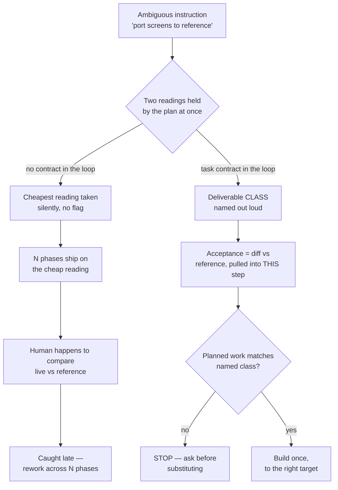

The evidence behind every gate in this suite. Short version: a model does not need to be weak to drift — it only needs to resolve one ambiguous instruction in the cheapest direction, once, with nobody watching closely enough to notice for ten phases.

## The headline finding

Before any of these gates existed, two real projects were mined for every session where a human corrected the model mid-flight — not style nitpicks, but "that is not what I asked for" corrections. The same handful of failure shapes kept recurring, across different codebases, different features, and different sessions, months apart.

The uncomfortable part is *which* model was running most of these sessions: a strong, current-generation model, not a cut-rate one. And it failed in exactly the ways the suite's authors had predicted a *weak* model would fail — silently cheapening a task, rebuilding something that already existed, marking things done on the flimsiest available signal, letting its own state files go stale. The strength of the model bought better prose and faster typing. It did not buy immunity from these shapes.

The second half of the finding is what actually justifies this whole tier of the suite: **every one of these failures was caught by a human, not by a gate.** There was no mechanism in the room whose job was to notice. The user had to happen to compare the live screen to the mockup, happen to check the deployed environment, happen to re-read the plan file and spot the contradiction. Nothing in the process forced the check. That absence is the entire reason the mechanism catalog exists — it is the suite's response to "we cannot keep relying on someone happening to notice."

:::note Read this as
Not "models are unreliable, be careful." Read it as: certain instruction shapes are structurally ambiguous, and *any* executor — carbon or silicon, strong or weak — will resolve that ambiguity toward the cheapest reading unless something outside the executor's own judgment forces the expensive reading into view.
:::

## Five failure-mode families

Every mined incident sorts into one of five families. Each has a real (anonymized) incident below, and the mechanism now standing between that failure and your codebase.

| Family | What it looks like | Contract rule that now catches it |
| --- | --- | --- |
| Task downgrade | An expensive, ambiguous instruction quietly resolves into its cheap reading | `E3` |
| Recreate, not reuse | A new component gets built that already exists somewhere in the tree | `E4` |
| Claim without proof | "Done ✅" rests on a command that was never actually run, or ran but proved nothing | `E2` |
| Lost state | A plan row or a pending intention goes stale and nothing notices | `E5` |
| Fabricated / sycophantic numbers | A percentage, a count, or a grade is invented or generously rounded up | `E1` |

## Family 1 — Task downgrade `E3`

This is the single most expensive failure shape mined from either project — the one that ran for the longest before anyone caught it.

**The incident.** A multi-phase epic asked for existing screens to be rebuilt to match a set of reference designs — "port every screen to the reference." The planning document that described the epic contained two readings of that instruction sitting side by side: one implying a structural rebuild, one implying the data layer stays untouched and only the view is swapped. Nobody flagged the contradiction. Starting a few phases in, the model quietly resolved it toward the cheaper reading: it recolored the existing screens — new palette, new borders, new fonts — while leaving every screen's underlying structure exactly as it was. Every phase after that inherited the same silent substitution. Ten phases shipped this way. The proof screenshots taken along the way showed only the result, never the result sitting next to the reference it was supposed to match — so nothing in the loop ever produced a picture where the gap was visible. It surfaced only when a human, independently, put the live app and the reference side by side and saw that nothing matched.

**Why it's dangerous, not just wrong:** at every individual checkpoint, the work looked like forward progress. The screens rendered. Nothing crashed. Reviews passed, because review was checking "does this follow the plan," and the plan itself had already absorbed the downgrade.

**The mechanism that now catches it:** a task-contract gate. Before any code is written for a task that names an external reference, the deliverable class — rebuild-to-reference, restyle, implement, stub, fix — must be named out loud, and the acceptance check becomes a same-viewport side-by-side diff against the named reference, never "renders and tests are green." If the planned work is a cheaper class than the instruction implies, that is a stop-and-ask, not a judgment call.

## Family 2 — Recreate, not reuse `E4`

**The incident.** While porting a settings screen toward a shared component library, the model hand-redrew several components that already existed in that library — a segmented toggle, a select input, a page header — instead of importing them. Each hand-drawn copy looked individually plausible. None of them matched the original pixel-for-pixel, so the visual drift compounded across the screen. The pattern repeated later in the same project even after a standing rule against it had already been written down once.

**Why it recurs even after being named once:** recreating something feels like progress in the moment — it's forward motion, a new file, visible output — while searching the tree for an existing implementation feels like a detour. A standing rule that lives only in a decision log or a memory file has to be actively recalled at exactly the right moment to prevent this; nothing forces the recall.

**The mechanism that now catches it:** a reuse gate, printed before any component or utility is authored: `REUSE <path>` or `EXTEND <path>` or `NEW (searched <where> — none fit)`. Recreating something that already exists is treated as a defect, not a style preference — and the search has to be shown, not asserted.

## Family 3 — Claim without proof `E2`

**The incident.** A typecheck command was run all session and reported zero errors every time. It was, under the project's actual compiler configuration, a command that structurally cannot fail — it always exits clean regardless of what the code contains. The real build command, run separately and much later, failed immediately on a genuine type error that had been sitting in the codebase the whole time. In an unrelated incident on the same project, a compliance gate was reported green while two critical bugs shipped live in production — the gate had asserted the mutating endpoint's own self-reported counters instead of checking the actual state of the data afterward.

**Why a green check is not evidence:** a check that has never been observed to fail carries no information when it passes. Both incidents share the same root: the thing being trusted was the code reporting on itself, not an independent, falsifiable observation of the outside world.

**The mechanism that now catches it:** ✅ is only printed after a command has actually executed in this session, with its exit code or count pasted — not estimated, not remembered from an earlier run. A skipped check prints an explicit skip reason, never a checkmark. And a project's canonical verification commands are recorded once in project memory and proven able to fail before they're trusted, rather than improvised per session.

## Family 4 — Lost state `E5`

**The incident.** A plan file's "current phase" pointer kept referencing an abandoned line of work while real effort had already moved elsewhere, which sent an automated router down the wrong branch more than once. Separately, a pull request that had already merged sat recorded as "parked" for days, because nothing forced the plan and ledger files to update in the same breath as the merge. And an architecture change shipped that quietly contradicted an already-ratified decision — nobody scanned the diff against the decision log, so no amendment was ever written.

**Why this is a memory problem, not a discipline problem:** the action that changes reality (a commit, a merge, a pivot) and the action that records it in a state file are two separate steps. In a long session, or a session that resumes after a break, it is easy to do the first and never circle back to the second — especially once the model's attention has moved to the next task.

**The mechanism that now catches it:** any action that changes phase reality writes its state row in the same turn, with an enumerated skip code if it genuinely can't (never silence). At commit and review time, the diff's touched routes and architecture are scanned against the decision log; a contradiction blocks until it's either reconciled or recorded as an amendment.

## Family 5 — Fabricated or sycophantic numbers `E1`

**The incident.** During an unrelated extraction task, a model invented CSS class names, a navigation tab count, and toast-notification style variants that did not exist anywhere in the source it was supposedly extracting from — all plausible-sounding, all fabricated. In a separate case, a whole plan phase and a formal decision record were built on the claim that a particular service did not exist in production, when the very state file being read to reach that conclusion already recorded, in its status column, that the issue was resolved. The model read the finding text and skipped the status column.

**Why this is the hardest family to self-catch:** a fabricated number and a real one are typographically indistinguishable. Nothing about "27%" or "4 tabs" signals whether it came from a grep or from a plausible guess — the only way to tell the difference is to demand the citation at the moment the number is produced, not after.

**The mechanism that now catches it:** every claim about code or state must cite a file:line or a command run this session; uncited claims are marked `(assumed)` and must be verified before anything is built on them. Claims that something does *not* exist require a recorded search with its empty result shown, not just asserted.

## The myopic insight — why this isn't really about model strength

There's a reusable idea underneath all five families, borrowed from the same lens the suite uses to review UX flows for short-sighted users: a person planning only one or two steps ahead will take whatever looks locally best, and any consequence sitting three or more steps past their horizon is *invisible to them at decision time* — not ignored, not weighed and dismissed, genuinely not seen. It isn't that they're careless; the mattress trap simply doesn't register as a trap from where they're standing.

An executor — human or model — resolving an ambiguous instruction behaves exactly like that depth-limited planner. Told to "port the screens to the reference," it sees the immediate, literal, few-steps-ahead reading (touch each screen, make it look plausible) clearly. The reading that actually matters — "in phase 7, someone is going to hold this next to the reference design and check whether it matches" — sits several steps beyond the literal instruction, on the other side of the horizon. It is not that the executor decided the consequence didn't matter. The consequence was never in view to be weighed at all.

This reframes what these gates are actually doing. None of them make the model "try harder" or "be more careful" — that's asking an executor to see past its own horizon by willpower, which doesn't work reliably for any executor. Instead, every mechanism above does the same one thing: it **pulls the distant consequence into the present**, rewriting it as a check the executor cannot avoid seeing right now, at the moment the ambiguous decision is actually being made. A task-contract line that says "acceptance = side-by-side diff against the reference, not renders + tests green" isn't a nicer way of asking for more effort — it relocates step 7's judgment into step 1's task row, where the depth-limited planner can actually see it.

## The diagram

Two paths through the same ambiguous instruction. The top path is what happens with nothing but model judgment in the loop. The bottom path is what a contract does to the same instruction.

## What this means day to day

None of these mechanisms exist because the suite distrusts you or the model running it. They exist because the corpus above is not hypothetical — every incident happened, on real work, and every one slipped past every check that existed at the time except a human's independent, unscripted comparison. The gates in [the mechanism catalog](mechanisms.html) and the E1–E7 rules in [the execution contract](contract.html) are the write-up of "what would have caught this," applied before the next version of the same failure gets a chance to run for ten phases instead of one.

:::note See also
[The E1–E7 contract](contract.html) for the exact rule text these mechanisms enforce, and [the mechanism catalog](mechanisms.html) for the full list of gates these five incident families produced.
:::
