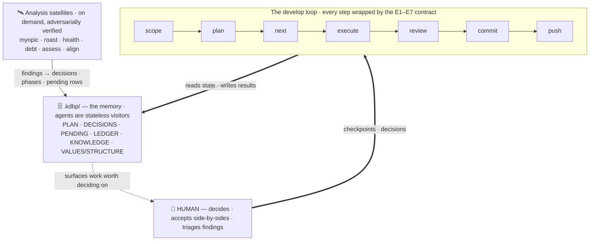

A file-based development discipline for building software with AI coding agents. Its one idea: **judgment should live in files, not in the model**. The plan, the decisions, the deferred debt, and the proof of every step are written down in a project's `.kdbp/` folder, so any agent — strong or weak, this session or the next — picks up exactly where the last one left off. This site documents the suite and the 2026-07 hardening that made its discipline mechanical rather than model-dependent.

## The system at a glance

The human sits *outside* the loop — driving it and deciding on what it surfaces, not typing. A shared execution contract (E1–E7) wraps every command so nothing claims "done" without evidence. The commands grind ideas into evidence-backed commits; the `.kdbp/` files are the memory the agents read and write; the analysis satellites bring back findings worth deciding on.

:::note The three load-bearing ideas
**(1) The model is the replaceable part** — state lives in files, so a session can die or a model can be swapped mid-project and the next visitor resumes from disk. **(2) Every arrow carries evidence, not claims** — the contract makes "done" unprintable without a command output, a `file:line`, or an artifact path. **(3) The human is the decision layer** — `DECISIONS.md` is the interface; the loop makes those decisions irreversible-in-the-good-way.
:::
