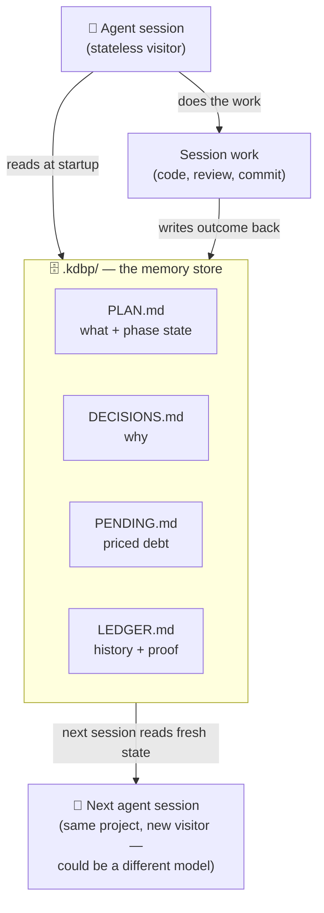

# What KDBP is

KDBP stands for **Khujta Deep Behavioural Protocol**. It is not a database and it is not a framework — it is a folder *and a discipline*. A project's plan, decisions, values, knowledge, and deferred work live in plain files under `.kdbp/`, and every agent session reads them at startup before doing anything else. The *protocol* part is what those files are for: they give an agent the context and the standing values it needs to align with the **intent** behind a prompt — what should happen in this codebase, and how it should behave while doing it — not just the literal words. Carrying that alignment in files instead of in the model's head is the whole idea.

## The one idea

An AI coding agent has no memory of its own between sessions. Close the chat, hit a context limit, or swap from one model to another, and whatever the agent "knew" about your project — the plan, the reasoning behind a tricky decision, the bug that's known-but-deferred — is gone unless it was written down somewhere the next session will actually look.

KDBP's answer is simple: put that memory in files, not in the model. The agent that shows up for today's session is a **stateless visitor** — it arrives empty-handed, reads `.kdbp/` to find out what's going on, does some work, and writes its findings back before it leaves. The **files hold the state**. The agent is replaceable; the folder is not.

:::note Why this matters in practice
A session can crash mid-task. You can switch from one model to a cheaper or newer one halfway through a project. A different person on your team can pick up the work tomorrow. In every one of those cases, the next agent opens `.kdbp/`, reads what's there, and resumes — because the plan, the open questions, and the reasoning were never trapped inside a conversation that's now gone.
:::

## The memory loop, visually

Every command in the suite (scoping, planning, executing, reviewing, committing) follows the same shape: read the relevant `.kdbp/` files first, do the work, then write the outcome back. Nothing is held only "in mind" across that boundary.

## What each file is for

Different kinds of memory change at different speeds, so KDBP splits them into separate files instead of one giant notebook. Some files change every phase; some change only when a real decision is made; some almost never change at all.

| File | Holds | Changes |
| --- | --- | --- |
| `PLAN.md` | The active goal and a phase table (what's being built, and its Exec/Review/Commit/Push state per phase). | Every phase |
| `DECISIONS.md` | Ratified forks in the road — the option chosen, the rationale, the alternatives considered, and the trigger that would reopen the question. | On each real decision |
| `PENDING.md` | Priced technical debt — a 10-column table (id, date, source, finding, file, scale tier, priority, impact, times-deferred, status) so deferred work doesn't vanish into vague TODOs. | On each deferral or resolution |
| `LEDGER.md` | Append-only session history — what shipped, what was reviewed, gate results, with proof (command output, file:line, artifact path) attached to every claim. | Every session, append-only |
| `KNOWLEDGE.md` | What the human has verifiably come to understand — topics taught and confirmed, so the suite stops re-explaining things already learned. | As understanding is verified |
| `SCOPE.md` | The stable premise — who this is for, what it does, the hard constraints. High-inertia; edited only through an explicit scope-change process. | Rarely — only on a real pivot |
| `ROADMAP.md` | The phase plan derived from SCOPE — medium-inertia, updated as phases complete, split, or get added. | Occasionally, on scope change or phase completion |
| `VALUES.md` / `STRUCTURE.md` / `BEHAVIOR.md` | Standing constraints — project values, allowed file locations, behavior rules — that outrank the model's own defaults. | Rarely — standing law for the project |

:::note Not a filing cabinet
The split isn't bureaucracy for its own sake — it's what lets an agent (or a human) find the right kind of memory fast. "What are we building right now?" is a `PLAN.md` question. "Why did we choose Postgres over SQLite here?" is a `DECISIONS.md` question. Separating them means a session doesn't have to re-read a novel of history just to find today's task.
:::

## Why this beats keeping state in the model's head

The alternative — relying on a long chat history, or on the model "remembering" a project across sessions — has three problems that KDBP is built to avoid:

- **It doesn't survive a restart.** Context windows fill up, sessions get compacted or closed, and anything not written down is paraphrased from memory at best, invented at worst.
- **It doesn't survive a model swap.** If the state lives only in a conversation with one model, moving to a stronger or cheaper model means starting the project's judgment over from scratch. If the state lives in files, any model can read them and continue.
- **It can't be audited.** A decision buried in a chat transcript is hard to find and easy to silently contradict later. A decision in `DECISIONS.md`, with its rationale and its review trigger written down, is something a future session — or a human — can check against before doing something that conflicts with it.

Files are slower to update than a thought, but they are the only kind of memory that outlives the session that had the thought. That trade is the whole bet KDBP makes.
