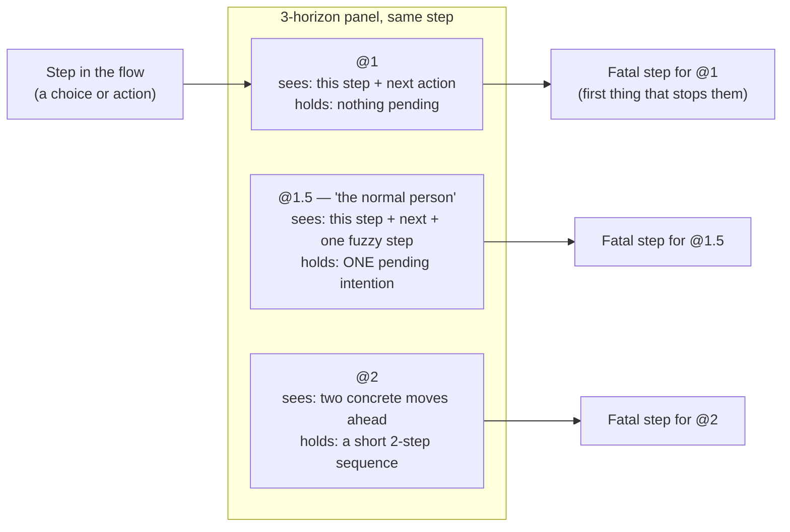

## Analysis satellites

The core loop — plan, execute, review, commit — is the path every change travels. The satellites are the other tools: not on that path, called on demand, each one built to attack the work from an angle the loop doesn't naturally take. You reach for one when something needs to be stress-tested before, during, or after the loop, not as a step the loop makes you take.

## What a "satellite" is, and why they're separate from the loop

The loop tools (`/gabe-plan`, `/gabe-execute`, `/gabe-review`, `/gabe-commit`) run in a fixed order because each one needs what the previous one produced — you can't execute a phase that was never planned. The six tools on this page don't work that way. Nothing forces you to run `/gabe-myopic` before a commit, or `/gabe-health` every sprint. They're satellites: they orbit the loop, get pulled in when a specific kind of risk is in the air, and hand their findings back into the same places the loop already reads — `.kdbp/PENDING.md`, `.kdbp/DECISIONS.md`, `.kdbp/RULES.md`. Nothing a satellite finds is a dead end; it always has somewhere to land.

Each satellite is **adversarial on purpose**. It doesn't ask "does this work?" the way a test suite does — it asks "what does this miss, and who does it hurt?" from a specific, named angle: a user who can't plan ahead, an expert perspective you chose, a codebase's structural history, a decision nobody actually made, an "obvious yes" that isn't, a value you said you'd hold to. Six angles, six different kinds of blind spot.

:::note The one thing every satellite now shares
Since the suite's hardening pass, every satellite in this list carries two non-negotiable habits on top of whatever else it does: an **Evidence line** on every finding (a real file:line, a quoted sentence, or a recorded search with its result — never a claim floating free of a source opened this session), and a **verify/kill pass** run on the full draft before anything is shown to you. Findings that fail verification are deleted, not softened to a lower severity. See 04 below for exactly how that pass works.
:::

## The six at a glance

Skim this table to find the tool that matches the risk you're worried about right now, then read its own section for the detail.

| Tool | Hunts for | Output shape |
| --- | --- | --- |
| `/gabe-myopic` | Steps in a flow that demand foresight a real, short-sighted user doesn't have | 3-horizon panel + step ledger + severity-ranked findings |
| `/gabe-roast [perspective]` | Gaps a named adversarial perspective (architect, security, UX…) would catch | Gaps grouped by maturity (MVP/Enterprise/Scale) × importance, each with a one-liner |
| `/gabe-health` | Structural fragility — god files, churn hotspots, coupling, bug concentration, scope creep | Six analyses with 🔴/⚠️/✅ severity bands and copy-pasted git-command numbers |
| `/gabe-debt` | Architectural decisions that were never made explicitly, or that silently contradict each other | Findings triaged into DECISIONS.md ADRs, SCOPE.md open questions, RULES.md rules, or PENDING.md |
| `/gabe-assess` | Hidden weight behind an "obvious" change — blast radius, right-sized scope, prerequisites | Five-dimension assessment ending in a recommendation + one-liner |
| `/gabe-align` | Drift from stated values (yours + the project's) and, at commit time, untested realistic scenarios | Per-value PASS/CONCERN/FAIL + a deterministic PROCEED verdict |

## `/gabe-myopic` — the short-sighted user, simulated

Every other satellite on this page attacks from an *expert's* vantage point — someone who knows what to look for. `/gabe-myopic` does the opposite, and that inversion is what makes it worth the extra room here. It asks: *what would a beginner fail to see coming?* Real people do not plan far ahead. They run a greedy, shallow search over the next step or two, optimize for that, and get blindsided by anything that only pays off — or costs — three or more steps later. The skill's own handle for this is vivid on purpose: *a chess beginner who sees one move ahead grabs the free pawn and walks straight into mate in two.* The board never warned them. The trap was legal, quiet, and from the inside felt entirely like their own fault.

The moment you catch yourself thinking "well, obviously they should just remember to set that earlier" — stop. That *obviously* is the expert leaking back in, and it is itself the finding: a step that only works if the user has foresight a normal person doesn't bring to it.

### The 3-horizon panel

Instead of simulating one generic "confused user," the skill runs three bounded-horizon personas over the same walk-through simultaneously, each blind past its own depth:

| Horizon | Sees ahead | Can hold in head | Breaks when… |
| --- | --- | --- | --- |
| **@1** | This step + the very next action | Nothing pending | Asked to prep for a later step |
| **@1.5** | This step + next + one fuzzy step after | Exactly one pending intention | A second pending thing shows up and evicts the first |
| **@2** | Two concrete moves ahead | A short 2-step sequence | The payoff is three or more steps out |

**@1.5 is "the normal person"** — treat a finding that traps @1.5 as the headline result, because that's most of your users. @1 is the fragility stress-test (what breaks the least patient users first); @2 is the generous floor (what even a fairly careful user still misses).

The realism comes from the **memory-eviction rule**: when a step introduces a new thing to remember, the oldest pending intention beyond that horizon's capacity is gone — the user will not "remember to" do it later just because it mattered. This is exactly what turns "set this now, it matters at checkout" into a trap: by the time checkout arrives, the @1.5 user has already evicted the reason they were supposed to care.

### The four flag types

The primary lens is foresight; the other three are what a short-sighted user runs into *because* they can't plan ahead, so they travel together as a cluster.

| Flag | Fires when… |
| --- | --- |
| 🛏️ Foresight trap (the mattress) | A choice's real cost or consequence lands two or more steps later, invisible right now — irreversible commits, path-dependency, "you should've set that earlier" |
| 🌊 Overwhelm point | One step demands more than roughly four simultaneous decisions or options — working memory holds about four chunks, not seven |
| 🧠 Recall demand | The user must carry a value or decision from an earlier step in their head to do this step correctly |
| 🚪 No-undo dead-end | The myopic path went wrong and there is no cheap way back |

This is the clearest illustration in the whole suite of the **"adversarially verified, evidence-cited" pattern** the hardening pass installed everywhere: a finding only survives if it names the exact step, quotes what the screen (or spec, or code) actually said at that step, and then gets run back through three kill questions before it's allowed in the report — see 04.

### Verbs

| Verb | What it does |
| --- | --- |
| `walk` (default) | Full panel walkthrough — the main event, produces the complete report below |
| `trap` | Laser mode — foresight traps only, skips the overwhelm/recall/undo cluster |
| `step` | Interactive — narrates one step at a time as the @1.5 user, waits for you to advance |
| `fix` | For flagged items, proposes the change that lowers the required foresight, not just "make it clearer" |
| `horizon` | 30-second gut check — "how many steps of foresight does this demand?", flags if more than two |

### Output shape

A myopic walk reports a **Panel result** (the fatal step per horizon — the first step where each user gets overwhelmed, lost, or trapped), a **Step ledger** (every step, what the user must do, which flags fire, and the worst horizon each catches), then the findings themselves, most severe first, each with what the myopic user actually does in first person, why the consequence sits beyond that horizon, who it catches, its Evidence line, and the horizon-collapsing fix.

:::note Use it when
Reviewing a UX flow, onboarding, checkout, wizard, form, or settings screen for whether normal people will get confused, overwhelmed, or trapped; when a flow "feels fine to us but users keep dropping off"; before shipping a multi-step flow; or to sanity-check a spec/PRD before anything gets built.
:::

## The shared hardening: Evidence line + verify/kill pass

Before the hardening pass, a satellite could hand back a finding that sounded right but was never actually checked against the thing it claimed to describe — a plausible-sounding gap instead of a proven one. Every satellite skill now carries two shared habits that close that gap, on top of the suite-wide [E1–E7 execution contract](contract.html) every gabe-* file already inherits.

**The Evidence line.** Every finding, from every satellite, must cite something opened this session: a `path:line` with a quoted snippet for code, a `§section` with a quoted sentence for a spec or doc, a quoted visible string for a screenshot or mockup, or — for a claim that something is *missing* — the exact search that was run and its empty result (for example, `grep -rn useBlocker src/ → 0 hits`). A finding with no Evidence line, or one that doesn't actually quote a source, does not get downgraded to a lower severity — it is deleted before you ever see it.

**The verify/kill pass.** After a satellite drafts every finding, it re-opens the cited source and asks three kill questions before anything is printed:

| Question | Checks |
| --- | --- |
| K1 — Beyond-horizon / real | Is the consequence actually as far out, or as real, as the finding claims? Re-check against the walk or the code. |
| K2 — Evidence | Does the cited source actually say what the finding claims it says? Re-open it and re-read. |
| K3 — Guard | Does an existing safeguard (an undo, a warning, a "what NOT to flag" rule) already cover this, making the finding moot? |

Each drafted finding is stamped `CONFIRMED`, `DOWNGRADED(<reason>)`, or `KILLED(K1|K2|K3)` — "plausible but unverified" counts as killed, not confirmed. The report header always prints the full funnel so nothing is hidden: `raw N → killed X → downgraded Y → survived Z`. This is the same discipline `/gabe-roast`'s kill-gate and `/gabe-debt`'s evidence floor apply in their own words — the mechanism generalizes across every satellite, not just `/gabe-myopic`.

## `/gabe-roast [perspective]` — adversarial gap review from a chosen angle

Where `/gabe-myopic` refuses to be the expert, `/gabe-roast` *requires* you to name one. You pick a perspective — architect, security auditor, UX designer, QA lead, DevOps engineer, domain expert, end user — and the skill reads the target fully, then attacks it the way that specific kind of professional would, worrying about exactly what they'd worry about and ignoring what they wouldn't. An architect never flags a typo; a UX designer never flags a missing database index.

Findings are classified along two independent axes: **maturity** (MVP — must fix before first use; Enterprise — must fix before real load and paying customers; Scale — must fix before 10x growth) and **importance** (Critical / High / Medium / Low). Each finding carries a Gap ID prefixed by its maturity bucket (M1, E1, S1…), a concrete description, a memorable Gabe Lens one-liner, a T-shirt effort estimate with a confidence note, a specific "what we lose" consequence, its Evidence line, and an optional suggested fix.

:::note Use it when
Self-reviewing your own design before building (the most effective use — you already know what you intended, the roast finds what you missed), stress-testing an architecture proposal, or validating a plan from a stakeholder perspective you don't naturally think from. Roasting the same target from several perspectives in sequence gives a 360-degree view; each pass tags its findings `NEW` or `covered by <ID>` against the prior roast.
:::

## `/gabe-health` — the codebase's own history as evidence

The four satellites above read a flow, a target, or a decision. `/gabe-health` reads **git history** instead, and asks where the codebase itself has already proven it's fragile. It runs up to six analyses: **god files** (touched in over a quarter of recent commits — everything has to edit them), **churn hotspots** (files most modified regardless of who touched them — a sign the design keeps needing adjustment), **coupling clusters** (files that always change together, so a change to one silently demands a change to the other), **bug-fix concentration** (where `fix:` commits cluster — the structurally fragile core), **scope creep** (comparing the plan's declared files against what actually got touched), and **deferred items & maintenance staleness** (aging entries in `PENDING.md` and overdue maintenance checklists).

Every number in the output is copy-pasted from a git command run in that same session — a churn count or a coupling percentage that wasn't produced by an actual command this run prints `<analysis> skipped` rather than an estimate. Severity uses a fixed threshold legend (🔴/⚠️/✅) so two runs are comparable.

:::note Use it when
Starting a new epic (know where the minefields are before walking in), during a retrospective ("why did this sprint feel fragile?" — now with data), after an incident (was this area inherently unstable, or a one-off?), or before a major refactor (which files need splitting first?). Not a per-commit tool — run it periodically for strategic insight, not on every diff.
:::

## `/gabe-debt` — decisions nobody actually made

Some of the worst bugs in a project's life didn't come from bad code — they came from a decision that was never made explicitly ("we'll figure out state ownership later") or one that quietly contradicts an earlier one (the scope doc says one thing, the plan's current phase assumes another, the code assumes a third). `/gabe-debt` scans for exactly that pattern using a catalog of evidence-anchored patterns distilled from real incidents, plus any project-local rules the team has already written down from its own retrospectives.

Every finding gets four scores — **severity** (tier-adjusted, elevated if it violates an existing rule), **confidence** (confident / uncertain-depends / weak-signal, based on how many independent sources agree), **blast radius** (how many phases, requirements, and files it touches), and a **status** (missing / implicit / contradictory / violating-existing-rule) — then gets triaged interactively into exactly one of four homes: a new architectural decision record, an open question for later, a codified rule, or a deferred item.

:::note Use it when
Before closing a scope change (verify it didn't introduce a critical decision gap), after a plan drafts a new phase (verify it doesn't violate an existing rule), before merging a feature that touches state, sync, permissions, or real-time behavior, or periodically as a drift check on well-trodden areas of the codebase.
:::

## `/gabe-assess` — the moment before an "obvious yes"

Someone proposes a fix mid-task and it feels quick. `/gabe-assess` is the pause between that proposal and agreeing to it — a snapshot of what you're actually signing up for, taken across five dimensions: **blast radius** (contained → local → cross-cutting → external), **maturity-appropriate scope** (is this fix over- or under-engineered for where the project actually is, not where you wish it were), **prerequisites** (what must be verified before the change is safe), **alternatives** (do nothing, defer, minimal fix, proper fix, or a workaround — each a real option, not a straw man), and, if the project has a `STRUCTURE.md`, **structural fit** (does the proposed file placement match an existing allowed pattern, or is it drifting into new territory?).

It closes on one recommendation and a memorable one-liner — never a gate, always a suggestion the human decides on. A "Contained, no prerequisites" verdict can also be the honest answer: "this is trivial after all, no assessment needed."

:::note Use it when
You're about to say "yes" reflexively to a tangent that emerged mid-task, a fix outside your current scope, or an "obvious" unblock with unclear downstream consequences. Not for trivially scoped changes (a variable rename, a typo) — the pause only earns its keep when the weight is actually hidden.
:::

## `/gabe-align` — checking the work against what you said you'd hold to

Every other satellite attacks from outside the project's stated intentions. `/gabe-align` checks the work *against* them — the values you and the project already wrote down. It runs at two different moments: a manual pre-flight check (shallow, standard, or deep, depending on how much is riding on the decision) before you build something, and an automatic checkpoint that fires at every `git commit` or `gh pr create` without you asking for it.

Values load from three stacking sources — universal structural guards built into the skill (A1-A7), your own cross-project values in `~/.kdbp/VALUES.md`, and this project's values in `.kdbp/VALUES.md` — and each gets an independent verdict: PASS, CONCERN, or FAIL, with any FAIL forcing a `DO NOT PROCEED` verdict and any CONCERN (with no FAIL) forcing `PROCEED WITH CONCERNS`. The automatic checkpoint adds a second layer standard/deep mode doesn't: for every changed source file, it names three realistic scenarios a real user would hit — including error states and empty data — and reports whether each one actually has a test. Untested scenarios a user proceeds past anyway get written straight into `PENDING.md` as deferred items, so the next `/gabe-review` finds them waiting.

:::note Use it when
Manually: before a new architecture or greenfield decision (deep mode), or as a quick sanity check before a roast or a non-trivial task (shallow/standard). Automatically: you don't invoke it at all — it fires on its own at every commit and PR, which is exactly the point. It's the one satellite in this list that isn't purely "on demand."
:::

## How findings get back into the loop

A satellite that only prints a report and goes away would be a dead end. Every one of these six writes (or explicitly recommends writing) its findings into a file the core loop already reads on its next pass, so nothing discovered off-loop gets lost between sessions.

| Satellite | Where findings land |
| --- | --- |
| `/gabe-myopic` | Findings reported inline; severity + fix feed into the next `/gabe-plan` or a direct code fix |
| `/gabe-roast` | Gaps reported inline; suggested next step is often `/gabe-assess` on each gap's fix before implementing |
| `/gabe-health` | Reported inline; recommends `/gabe-roast architect` on god files, `/gabe-review` on fragile modules |
| `/gabe-debt` | `.kdbp/DECISIONS.md`, `.kdbp/SCOPE.md` §14, `.kdbp/RULES.md`, or `.kdbp/PENDING.md` — user's choice per finding |
| `/gabe-assess` | Reported inline as a recommendation; the human decides and the loop proceeds accordingly |
| `/gabe-align` | `.kdbp/LEDGER.md` (every checkpoint) + `.kdbp/PENDING.md` (untested scenarios the user proceeded past) |

That's the whole shape of "satellite": attack from an angle the loop doesn't naturally take, cite evidence for every claim, survive a verify/kill pass, and land the surviving findings somewhere the loop will read next time it comes around.
