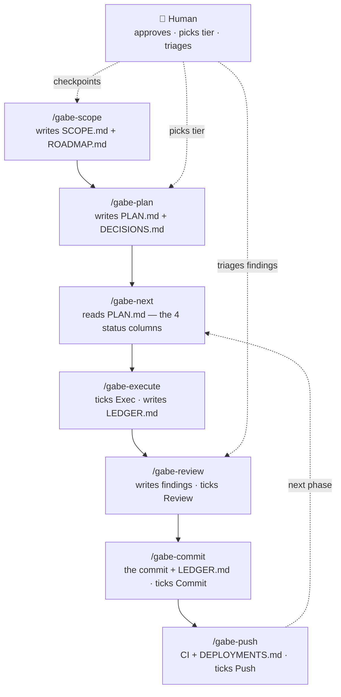

Seven commands take an idea from "we should build X" to a shipped, verified commit: `/gabe-scope` → `/gabe-plan` → `/gabe-next` → `/gabe-execute` → `/gabe-review` → `/gabe-commit` → `/gabe-push`. Each one reads a bit of `.kdbp/` state, does one job, and writes the next command's inputs back to disk. Nobody has to remember what happened three sessions ago — the files remember for you.

## The idea in one paragraph

Think of the loop as a relay race where the baton is a folder, not a runner's memory. `/gabe-scope` writes down the premise once. `/gabe-plan` turns a slice of that premise into phases with a size decision attached to each one. `/gabe-next` looks at a small state table and says, mechanically, "you're here, go there" — it does not think, it just routes. `/gabe-execute` is where code actually gets written, one task at a time, committing as it goes. `/gabe-review` prices the risk in what changed. `/gabe-commit` is the one gate everything must pass through before a commit exists. `/gabe-push` gets it into the world and proves it's actually live. If a session ends mid-phase, the state table remembers exactly where it stopped — the next session (or the next model) picks the baton up without a hand-off conversation.

:::note Why a router instead of "just remembering"
Models don't reliably remember what happened last session, and even within a session they can lose the thread under load. `/gabe-next` replaces "what should I do now?" — a question an LLM might answer differently each time — with a lookup against four state columns in a markdown table. Same input, same output, every time, for free.
:::

## The loop, step by step

Read this table left to right: each step's whole job, what it needs to already be true on disk before it can run, and what it leaves behind for the next step to find.

| Step | What it does | Reads | Writes |
|---|---|---|---|
| `/gabe-scope` | Turns a raw idea into a stable premise: problem, users, success criteria, requirements, constraints. Runs once per project (or once per pivot) with a checkpoint after every step — nothing here ships without your explicit sign-off. | Your answers to its intake questions; existing docs it finds as reference material | `SCOPE.md` (the premise) + `ROADMAP.md` (the phase-level plan derived from it) |
| `/gabe-plan` | Breaks a goal (often one ROADMAP phase) into concrete phases, and for each phase runs a short "how much rigor does this deserve?" decision — MVP, Enterprise, or Scale — so nobody quietly over- or under-builds. | `BEHAVIOR.md` (project maturity/tech), `SCOPE.md`/`ROADMAP.md` if present, `PENDING.md` for related open items | `PLAN.md` (phases table + per-phase tier/scope/acceptance), a tier-decision entry in `DECISIONS.md` per phase, a line in `LEDGER.md` |
| `/gabe-next` | Zero-reasoning router. Looks at the current phase's four status cells and dispatches to whichever command owns the first unfinished one. Never writes code, never judges quality — it's a lookup table with a phase pointer. | `PLAN.md` (Current Phase pointer + the Exec/Review/Commit/Push cells) | Nothing of its own — advances the Current Phase pointer in `PLAN.md` only when a phase's four cells are already all ✅ |
| `/gabe-execute` | Implements the current phase's tasks one at a time, under a strict task contract (quote the task text, reuse before creating, commit at boundaries), checkpointing after each one rather than dumping the whole phase as one uninspectable diff. | `PLAN.md` (phase Description/Scope/References/Acceptance) | Ticks Exec to 🔄 then ✅ in `PLAN.md`, a task checklist under Phase Details, proof lines + token cost in `LEDGER.md` — and invokes `/gabe-commit` at each checkpoint rather than raw `git commit` |
| `/gabe-review` | Reviews the diff for the phase and prices each finding by risk — what it costs if you ship it anyway, not just "this is bad." Ends in an interactive triage so you decide what gets fixed now versus deferred. | `PLAN.md` (which phase needs review), `LEDGER.md` (files touched), the actual diff | `REVIEW.md` (findings + triage record), ticks Review to ✅ in `PLAN.md` when triage completes |
| `/gabe-commit` | The one door every commit walks through. Runs the deterministic checks (lint, types, tests, deferred-item scan, doc-drift, structure) and will not let a commit through with unresolved CRITICAL findings. **Never bypass this with raw `git commit`.** | `REVIEW.md` if present, `STRUCTURE.md`, `DOCS.md`, `PENDING.md` | The actual commit, an entry in `LEDGER.md`, updates to `PENDING.md` for deferred items, ticks Commit to ✅ in `PLAN.md` |
| `/gabe-push` | Pushes the branch, opens or updates the PR, watches CI, and then checks that the deployed target is actually healthy — CI green is not treated as proof by itself; a live probe is. | `PUSH.md` (env definitions), current branch/commit state | `DEPLOYMENTS.md` (deploy event record), `LEDGER.md` entry, ticks Push to ✅ in `PLAN.md` only if CI passed and deploy-verify succeeded |

## The loop as a diagram

Every arrow below is one command call; the label under each node is the state file it touches. The human sits above the loop — approving scope, picking a tier, triaging findings — rather than typing every step by hand.

## The router in practice

`/gabe-next` is the piece that makes the loop feel automatic instead of like a checklist you have to remember. It reads exactly one thing — the current phase's row in the Phases table — and applies a fixed rule, top to bottom: if Exec isn't done, run execute; if Review isn't done, run review; if Commit isn't done, run commit; if Push isn't done, run push; if all four are done and there's another phase, advance the pointer and check again; if there's no phase left, offer to close the plan out. No judgment calls, no LLM cost, no way for two runs on the same state to disagree.

| Exec | Review | Commit | Push | /gabe-next routes to |
|---|---|---|---|---|
| ⬜ | ⬜ | ⬜ | ⬜ | `/gabe-execute` — nothing built yet |
| 🔄 | ⬜ | ⬜ | ⬜ | `/gabe-execute` — resume, in progress |
| ✅ | ⬜ | ⬜ | ⬜ | `/gabe-review` — built, not yet reviewed |
| ✅ | ✅ | ⬜ | ⬜ | `/gabe-commit` — reviewed, not yet committed |
| ✅ | ✅ | ✅ | ⬜ | `/gabe-push` — committed, not yet shipped |
| ✅ | ✅ | ✅ | ✅ | advance to next phase, or offer to close the plan |

Because the rule reads column state rather than session memory, an interrupted session is cheap to resume: `/gabe-execute` finds Exec sitting at 🔄, reads the ticked task rows to know exactly what's already committed, and picks up at the next task — it never silently re-does finished work, and it never claims a task is done just because the conversation "remembers" doing it.

## The cadence rule: one phase per session

:::note Close it or checkpoint it
A session should finish one phase, or leave it in a state the next session can resume cleanly. That means: don't stop mid-task with uncommitted work and no note about what's left; don't let Exec sit at 🔄 with a stale task list nobody will recognize a week from now. Every phase transition is a natural place to end a session — the four-column tick is already the checkpoint, so honoring it costs nothing extra.
:::

This rule exists because sessions *will* get interrupted — context runs out, the human has to leave, a different task takes priority. The loop is built so that's fine as long as the interruption happens at a clean boundary: a ticked task, a committed change, a phase pointer that still points somewhere real. What breaks the loop is stopping *without* writing that state down — code sitting in a stash, a task claimed "basically done" in conversation but never ticked. The next session (possibly a different model entirely) trusts the files, not the transcript.

## Where the human checkpoints sit

The loop automates the mechanical parts — routing, ticking, checking — and deliberately leaves the judgment calls to you. Three points always stop and wait:

- **Plan · tier pick — MVP, Enterprise, or Scale.** `/gabe-plan` shows the trade-off matrix for each phase and waits for you to pick a tier. Escalating past MVP requires a one-sentence reason, logged to `DECISIONS.md` — de-escalating to MVP needs no justification at all.
- **Review · triage — Fix, defer, or accept each finding.** `/gabe-review` never silently fixes or silently ignores. Every finding gets a decision from you, and the ones you defer land visibly in `PENDING.md` instead of disappearing.
- **Commit · gate — Nothing critical slips through.** `/gabe-commit` blocks on unresolved CRITICAL findings. You can force a commit through with an explicit written justification, but you can't do it by accident.

## Where to go next

This page showed the shape of the loop. The next layer down is the contract every one of these seven commands shares — the rules that make "done" mean something specific instead of whatever a model felt like claiming.

- **Tier 2 · The contract — [The E1–E7 execution contract](contract.html).** Seven floors under every command — evidence, run-before-✅, no silent downgrade, reuse-first, state-sync, missing-anchor-stop, report-where.
- **Tier 2 · Reference — [Command reference](commands.html).** Every gabe command in full detail — flags, gates enforced, exact state file locations.
- **Tier 1 · Concept — [What KDBP is](kdbp.html).** If you haven't read this yet: the core idea behind every file this page named — why state lives in `.kdbp/` instead of in a model's memory.
