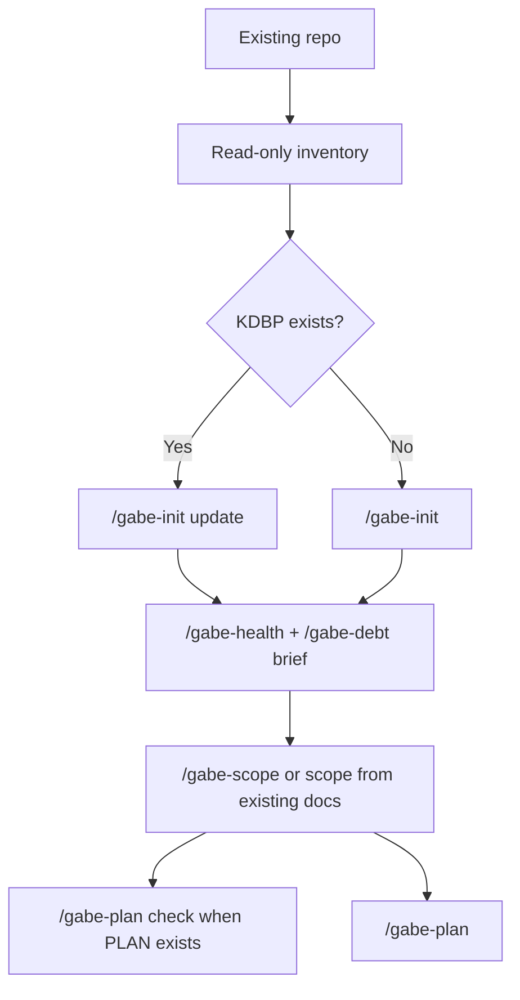

# Brownfield Workflow

**Purpose:** adopt Gabe Suite into an existing codebase without pretending it is a fresh project.

## Shape

Brownfield work starts with evidence, not intention. The repository already contains decisions, shortcuts, tests, and drift. Gabe Suite should first discover those facts and only then create KDBP structure around them.



This guide covers KDBP adoption (init/scope/plan). For adopting the **Testing Command Center** into an existing codebase — archiving legacy docs, bootstrapping the center, and ingesting the back-catalog one approved section at a time — the dedicated command is `/gabe-adopt`.

## Step 1 - Inventory Without Writing

Before any Gabe command mutates the repo, inspect:

- `git status --short --branch`
- existing docs and README
- package manifests and test scripts
- source tree layout
- current CI and deployment files
- existing architecture decisions, ADRs, issue docs, or planning files
- whether `.kdbp/` already exists

The goal is to avoid AP2 surprise and AP12 undocumented-decision damage. Brownfield adoption should not overwrite or reinterpret existing project truth without evidence.

## Step 2 - Choose the Adoption Path

| Existing state | Path |
|----------------|------|
| `.kdbp/` exists | use `/gabe-init update` for non-destructive template top-up |
| no `.kdbp/`, but repo has code | use `/gabe-init <name>` cautiously after inventory |
| active older `PLAN.md` exists | use `/gabe-plan check` before executing |
| existing docs already define scope | feed them into `/gabe-scope` reference frame |

`/gabe-init update` must not overwrite user-authored files. It should add missing KDBP files, run schema migrations when accepted, and preserve existing content.

## Step 3 - Establish a Baseline

Run:

```sh
/gabe-health
/gabe-debt brief
```

Use the baseline to find:

- god files and churn hotspots
- coupling clusters
- missing or implicit decisions
- rule violations from existing lessons
- AP citations that explain architectural pressure

Do not use the baseline as an excuse to refactor everything. Route findings into `PENDING.md`, `DECISIONS.md`, or a staged plan.

## Step 4 - Capture Existing Scope

If the project has no `.kdbp/SCOPE.md`, run:

```sh
/gabe-scope
```

Use the Reference Frame step to add existing docs as authoritative or suggestive references. Brownfield scope should summarize what the repo already is before it describes what it should become.

If scope already exists and needs a change, use:

```sh
/gabe-scope-change "what changed"
```

## Step 5 - Retrofit or Create a Plan

If an active plan exists:

```sh
/gabe-plan check
```

Use the report to identify missing columns, missing phase details, missing tier decisions, or missing decision records. Apply retrofits only after reviewing the preview.

If no active plan exists:

```sh
/gabe-plan "next stabilization or feature milestone"
```

For brownfield projects, the first plan should usually stabilize observability, tests, structure, or documentation before large feature work.

## Step 6 - Execute in Narrow Slices

Use `/gabe-next` once KDBP state is coherent. Keep slices small because brownfield risk is usually hidden in coupling and implicit state.

Expected loop:

```sh
/gabe-next
/gabe-review
/gabe-commit
/gabe-push
```

Run `/gabe-review` tightly on changed areas and include untracked files that are clearly part of the same change set.

**Understanding what already shipped:** if the project has (or bootstraps) a Testing
Command Center, `/gabe-feature backfill` is a first-class brownfield tool — it walks
served phases newest-first and turns each into an explainable page (card + diagrams +
test angles + evidence), with honest tiers for history: `full` for recent work,
`card-only` when evidence can't be re-run, `skip(reason)` for dropped work. New
features then join the per-phase rhythm (`… /gabe-review → /gabe-feature <phase> →
/gabe-commit …`) so the center never falls behind again.

## Brownfield AP Watchlist

| AP | Watch for |
|----|-----------|
| AP2 minimize surprise | behavior that existing users or maintainers already rely on |
| AP4 everyone will not just | manual runbooks posing as safety |
| AP6 coupling | refactors that force unrelated areas to move together |
| AP8 explicit state | hidden caches, implicit flags, stale async listeners |
| AP9 single source of truth | duplicated config, schema, constants, or generated files |
| AP11 testability | logic that requires full-system boot for small checks |
| AP12 documented decisions | architecture implied only by old code |

## Acceptance Signals

Brownfield adoption is ready for normal phase execution when:

- `.kdbp/` exists and important existing docs are reflected in scope or references.
- current risk has been baselined with `/gabe-health` and `/gabe-debt brief`.
- an active plan passes `/gabe-plan check`, or a new plan exists.
- major implicit decisions are either recorded in `DECISIONS.md` or tracked in `PENDING.md`.
- the first execution slice has a bounded blast radius and a clear test path.

## Avoid

| Avoid | Use instead |
|-------|-------------|
| treating brownfield as greenfield | inventory first |
| rewriting docs before reading code | reference existing docs, then reconcile |
| broad refactor as first plan | stabilization or narrow feature slice |
| direct SCOPE edits | `/gabe-scope-change` |
| hiding adoption gaps in chat | `PENDING.md`, `DECISIONS.md`, or `RULES.md` |
