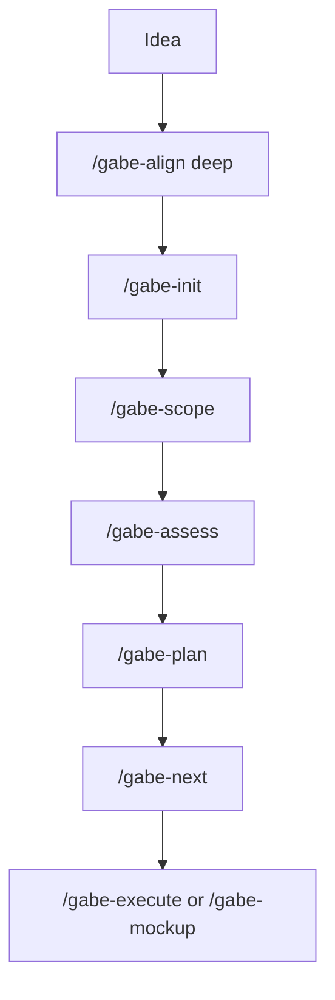

# Greenfield Workflow

**Purpose:** take a new app from idea to first implementation phase using Gabe Suite without locking in weak architecture by accident.

## Shape

Greenfield work starts with the highest uncertainty. The job is to reduce that uncertainty before the first plan hardens.



The diagram is intentionally serial. Gabe Suite is a one-active-plan workflow at MVP maturity.

## Step 1 - Check the Idea

Run:

```sh
/gabe-align deep "<one paragraph app idea>"
```

Use this before scaffolding. Standard/deep alignment loads AP1-AP13, so the early check should look for:

- AP1 single idea: can the product be described as one coherent idea?
- AP2 minimize surprise: would users and maintainers predict the behavior?
- AP8 explicit state: is the main state model visible?
- AP9 single source of truth: which records become canonical?
- AP11 testability: can the first slice be tested without heroic setup?
- AP12 documented decisions: which choices need durable records?

This output is advisory. Concerns should shape scope and planning, not block the idea.

## Step 2 - Initialize KDBP

Run:

```sh
/gabe-init <project-name>
```

Choose project type deliberately:

| Project type | Use when |
|--------------|----------|
| `code` | backend, CLI, library, or product work without a mockup phase ladder |
| `mockup` | design/UX project where `/gabe-mockup` owns execution |
| `hybrid` | product code plus mockup/UI phases in the same plan |

After init, `.kdbp/` becomes the durable project memory. `CLAUDE.md` is the root discovery file for Claude Code.

## Step 3 - Scope Before Planning

Run:

```sh
/gabe-scope
```

The scope command writes:

- `.kdbp/SCOPE.md` (stable premise plus the phase arc in its `## Phases` section)
- `.kdbp/scope-references.yaml`
- research artifacts when research is used

Treat SCOPE as the high-inertia premise. If the premise changes later, use `/gabe-scope-change`; do not edit SCOPE directly.

## Step 4 - Stress the First Plan

Before `/gabe-plan`, run at least one pressure check:

```sh
/gabe-assess "initial architecture and first build phase"
/gabe-debt brief
```

Use `/gabe-debt brief` after scope exists. It can surface missing decisions and cite AP principles when evidence supports the citation.

## Step 5 - Plan the First Build Slice

Run:

```sh
/gabe-plan "first milestone"
```

The plan should produce phases that are independently reviewable and testable. Watch for:

- phases that mix unrelated product ideas
- phases where state ownership is unclear
- phases that require manual sync as the main safety mechanism
- phases whose test strategy is vague

Those are usually AP1, AP4, AP8, AP9, or AP11 concerns.

## Step 6 - Execute Through the Router

Run:

```sh
/gabe-next
```

`/gabe-next` dispatches based on `.kdbp/PLAN.md` state:

- Exec pending: `/gabe-execute`
- Review pending: `/gabe-review`
- Commit pending: `/gabe-commit`
- Push pending: `/gabe-push`

**Projects with a Testing Command Center** (`docs/site/center/` — see `/gabe-feature`)
add one step to the per-phase rhythm, between review and commit:

```
/gabe-execute → /gabe-review → /gabe-feature <phase> → /gabe-commit → /gabe-push
```

That slot is where all of `/gabe-feature`'s inputs exist (shipped commits, review
verdict, test runs) and the commit then carries the regenerated center pages in the
same checkpoint. `/gabe-next` stays cell-only (zero-logic); the feature step is part
of the close-out ritual, not a PLAN cell — promoting it to a cell is D6/Wave-2.
At PLAN time, the lightweight counterpart: note in the phase's `proof` which of the
five angles (pytest · vitest · journey · deployed · motion) the phase commits to —
`/gabe-feature` reads the promise back at close-out.

For React-first UI projects, run:

```sh
/gabe-mockup design-ref
```

Do this before spreading visual/layout work across Storybook. It creates `docs/rebuild/ux/DESIGN.md` as the durable design grammar for later `/gabe-mockup react-story` work.

## Acceptance Signals

A greenfield project is ready for first implementation when:

- `.kdbp/BEHAVIOR.md`, `SCOPE.md`, `PLAN.md`, `PLAN.json`, and `DECISIONS.md` exist.
- The first phase has a clear tier and testable acceptance signal.
- AP concerns from `/gabe-align deep` are either resolved, recorded as decisions, or accepted as explicit tradeoffs.
- `/gabe-next` can identify the first phase and dispatch to the right execution command.

## Avoid

| Avoid | Use instead |
|-------|-------------|
| Writing code before scope | `/gabe-scope` |
| Treating AP concerns as hard blockers | record tradeoffs and proceed consciously |
| Editing SCOPE directly | `/gabe-scope-change` |
| Raw `git commit` | `/gabe-commit` |
| New static HTML mockups in React-first projects | `/gabe-mockup react-story` |
