# Diagram Pattern Library — Inspirational Reference

Use this library when the minimal skeletons in `SKILL.md` aren't enough and a doc genuinely needs **advanced composition** — subgraphs, multi-layer flows, styled nodes, state machines with notes, or sequence diagrams with multiple actors + alt-branches.

**How to use:**

1. Start with `SKILL.md` → per-doc-type matrix + per-well table → pick the right diagram **type**.
2. If the diagram needs ≥3 actors, ≥3 layers, parallel branches, or the reader must see hierarchy → consult this library for a pattern.
3. Copy the **composition idea** (subgraph grouping, color legend, `-.->` for implicit edges, notes on sequence diagrams) — not the domain-specific content.
4. Keep the `5-10 nodes ideal, 15 maximum` rule from `SKILL.md`. Library examples often exceed that ceiling because they document a whole system; your docs should stay scoped.

**Pattern → example index:**

| Need | Example in library |
|---|---|
| Three-layer stack with dotted cross-edges | §0 Three-Layer Configuration |
| Progressive horizontal flow (A → B → C → D) | §0b Progressive Knowledge Disclosure |
| Router with 5+ branches each producing distinct artifact | §1 Command Router |
| Mindmap taxonomy | §2 Five Domains Overview |
| State machine with notes + implicit self-loop | §3 Agent Loop Lifecycle |
| Coordinator + N subagents with role colors | §4 Coordinator-Subagent |
| Decision tree (binary) with outcome branches | §5 Workflow Enforcement Decision |
| Quality pyramid (L3 → L2 → L1) | §6 Tool Design Pyramid |
| Hierarchical config (user → project → dir) with nested subgraphs | §7 Config Hierarchy |
| Pipeline with validation + retry loop | §8 Structured Output Pipeline |
| Generation → independent review → routing | §9 Multi-Pass Review |
| Budget/strategies/escalation three-tier | §10 Context Management |
| Sequence with `alt`-branches for multiple modes | §11 KDBP Session Lifecycle |
| Anti-pattern → fix pairing (parallel lists) | §12 Anti-Pattern → Fix |
| Defense-in-depth with classifier fork | §13 5-Layer Guardrail |
| Sequence with dynamic hook registration + note | §14 Skills ↔ Hooks |

Source content retains Brownbull/Claude-agent domain terms; treat terms as placeholder, keep structure.

---

# Brownbull — Visual Architecture

## 0. Three-Layer Configuration Model (Foundation)

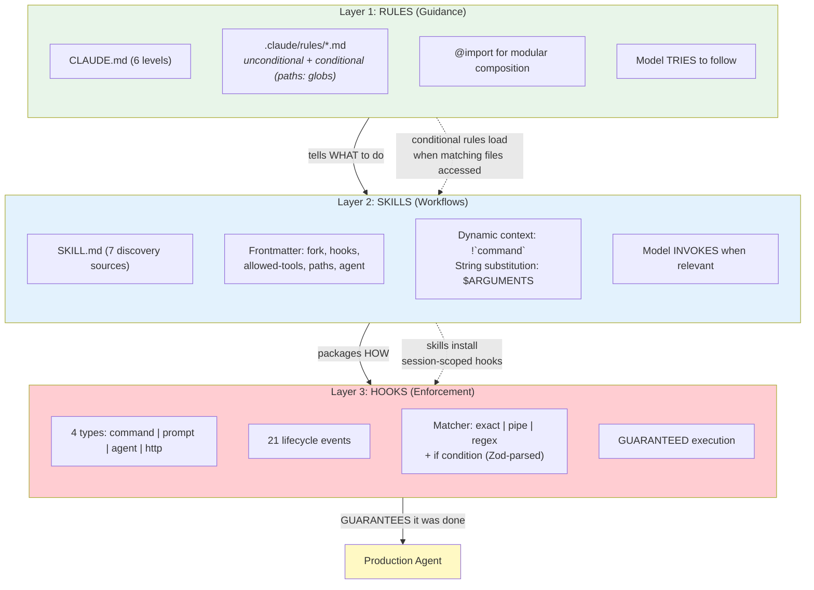

## 0b. Progressive Knowledge Disclosure (4 Temporal Scales)

```mermaid
flowchart LR
    subgraph START["Session Start (~10K tokens)"]
        direction TB
        SS1["System prompt (memoized sections)"]
        SS2["CLAUDE.md hierarchy (6 levels)"]
        SS3["MEMORY.md index (200 lines)"]
        SS4["Unconditional rules"]
        SS5["Skill names (1% budget)"]
        SS6["Deferred tool names only"]
    end

    subgraph TURN["Per Turn (variable, capped)"]
        direction TB
        PT1["Relevant memories<br/>(Sonnet side-query, max 5)"]
        PT2["Delta announcements<br/>(only changes)"]
        PT3["Conditional rules<br/>(on file access)"]
        PT4["Changed files<br/>(mtime check)"]
    end

    subgraph DEMAND["On Demand"]
        direction TB
        OD1["ToolSearch<br/>(schemas by keyword)"]
        OD2["MCP resources<br/>(List → Read)"]
        OD3["Full memory content"]
    end

    subgraph PRESSURE["Under Pressure"]
        direction TB
        UP1["Microcompact<br/>(clear old tool results)"]
        UP2["History snip<br/>(hide old turns)"]
        UP3["Full LLM compact<br/>(9-section summary)"]
        UP4["Post-compact restoration<br/>(top 5 files + deltas)"]
    end

    START --> TURN --> DEMAND --> PRESSURE

    style START fill:#c8e6c9
    style TURN fill:#bbdefb
    style DEMAND fill:#fff9c4
    style PRESSURE fill:#ffcdd2
```

## 1. Command Router

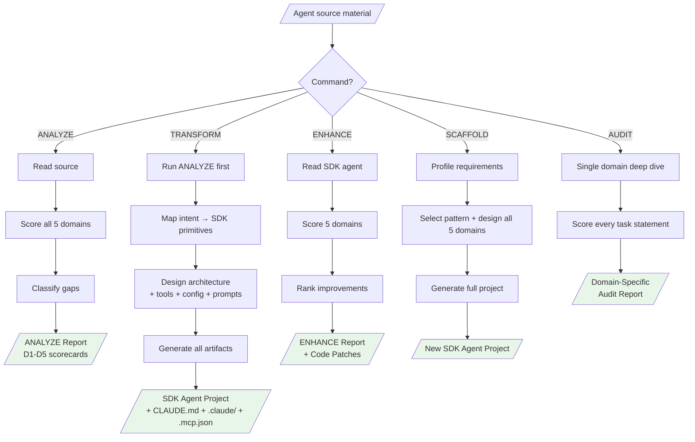

## 2. Five Domains Overview

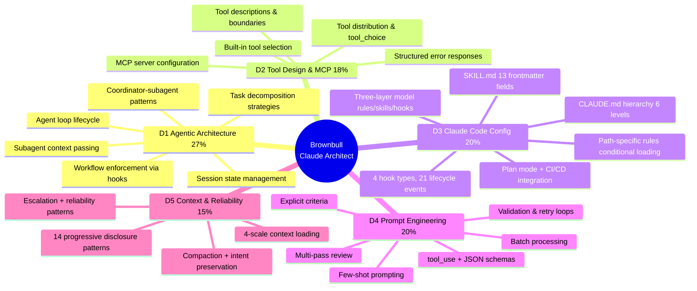

## 3. Agent Loop Lifecycle (D1)

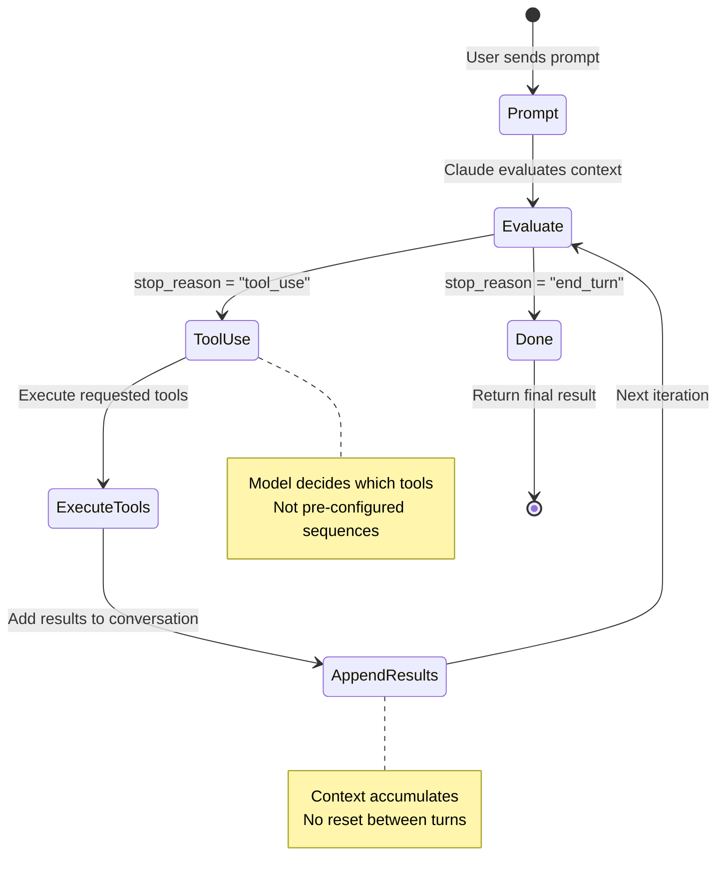

## 4. Coordinator-Subagent Architecture (D1)

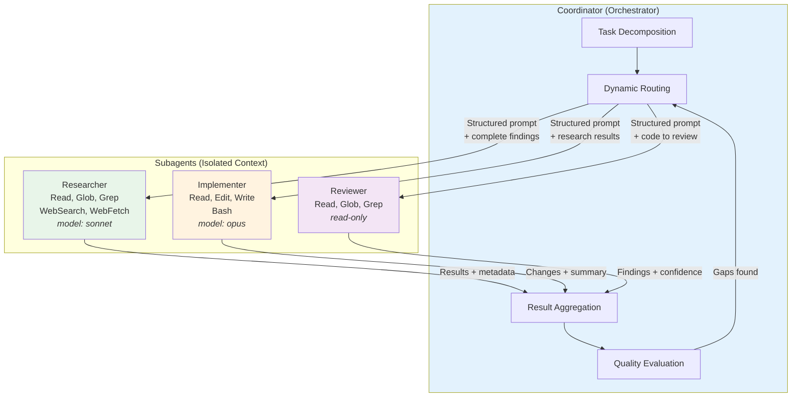

## 5. Workflow Enforcement Decision (D1)

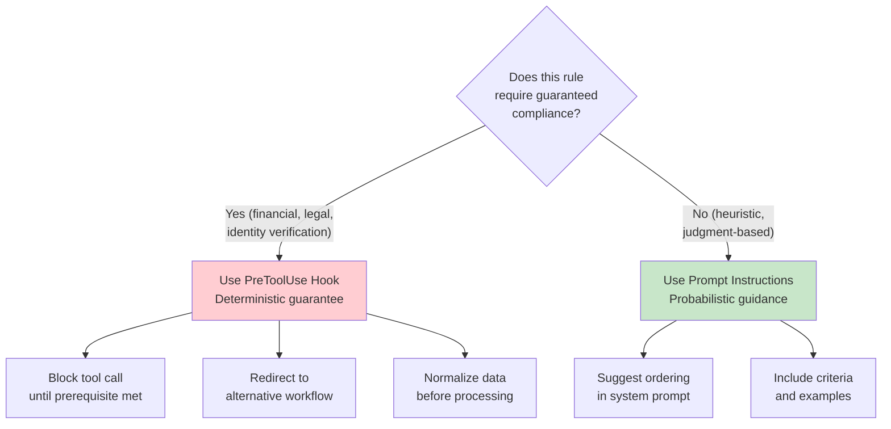

## 6. Tool Design Pyramid (D2)

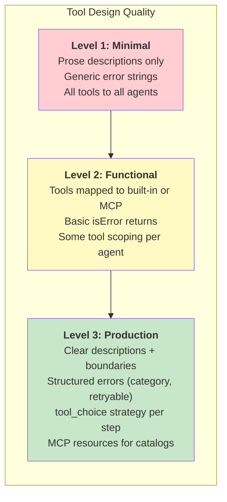

## 7. Claude Code Configuration Hierarchy (D3)

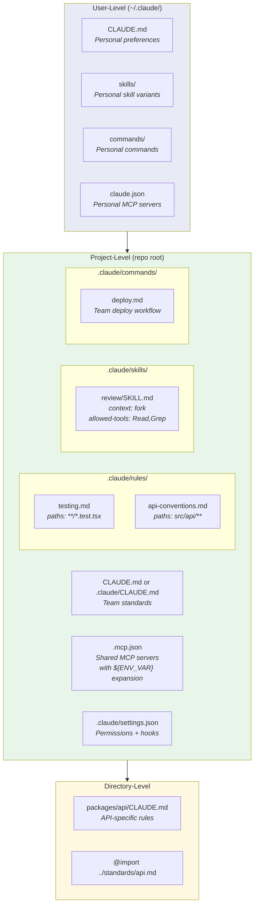

## 8. Structured Output Pipeline (D4)

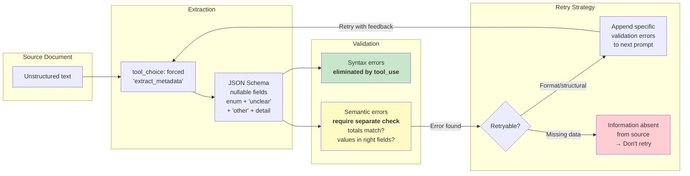

## 9. Multi-Pass Review Architecture (D4)

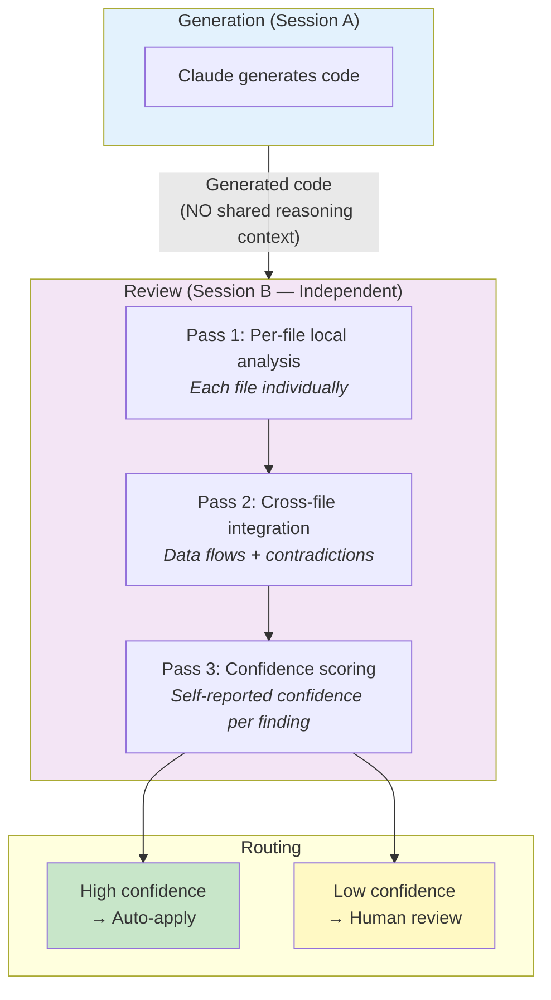

## 10. Context Management Strategy (D5)

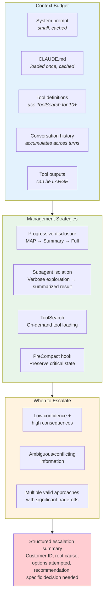

## 11. KDBP Session Lifecycle

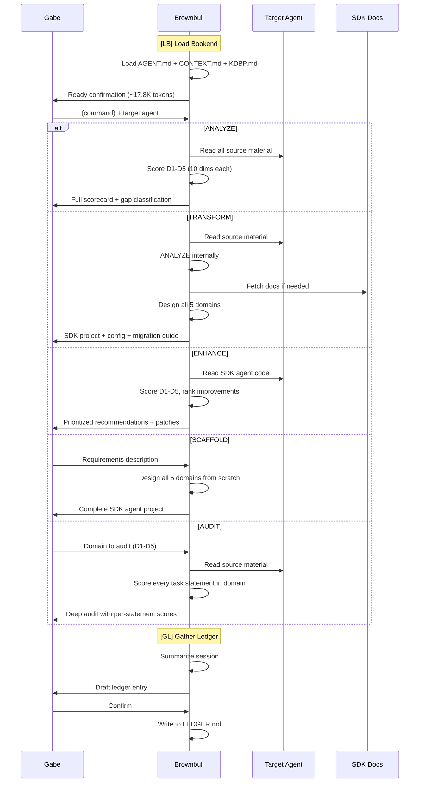

## 12. Anti-Pattern → Fix Flow

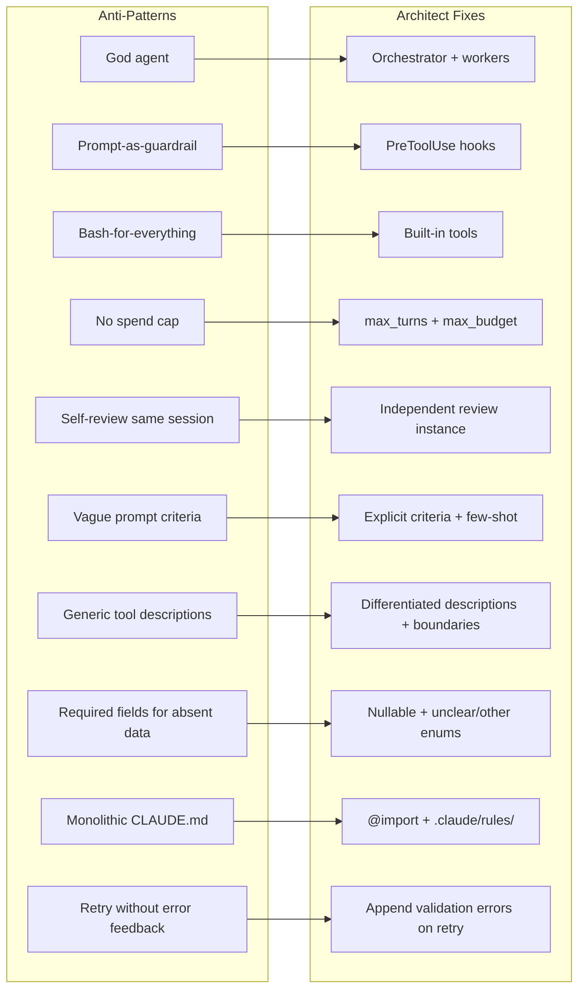

## 13. 5-Layer Guardrail System (from Source Code)

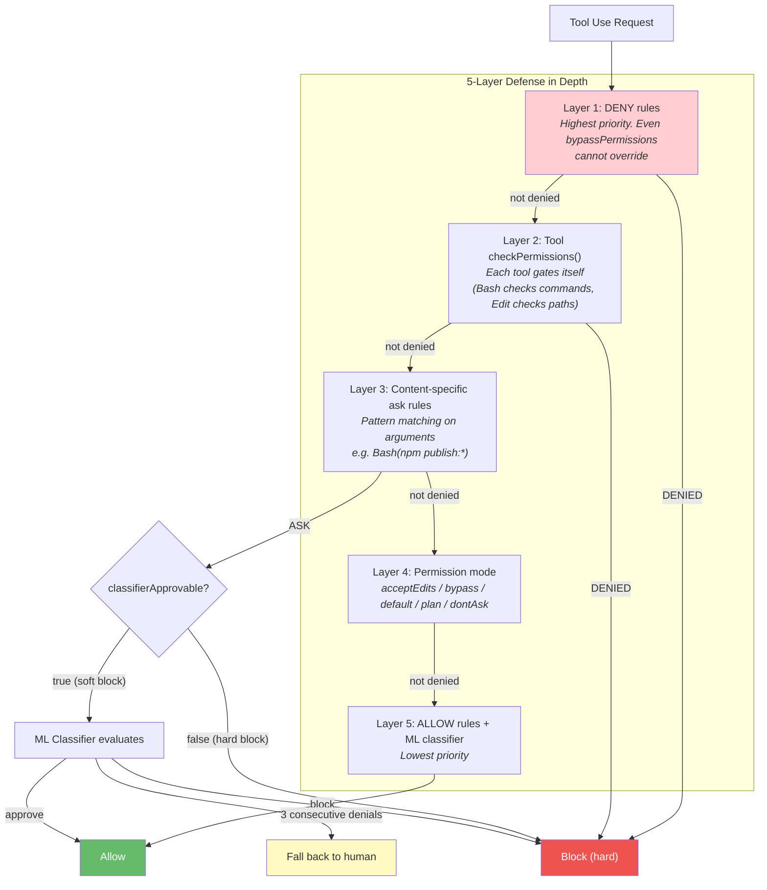

## 14. Skills ↔ Hooks Interaction

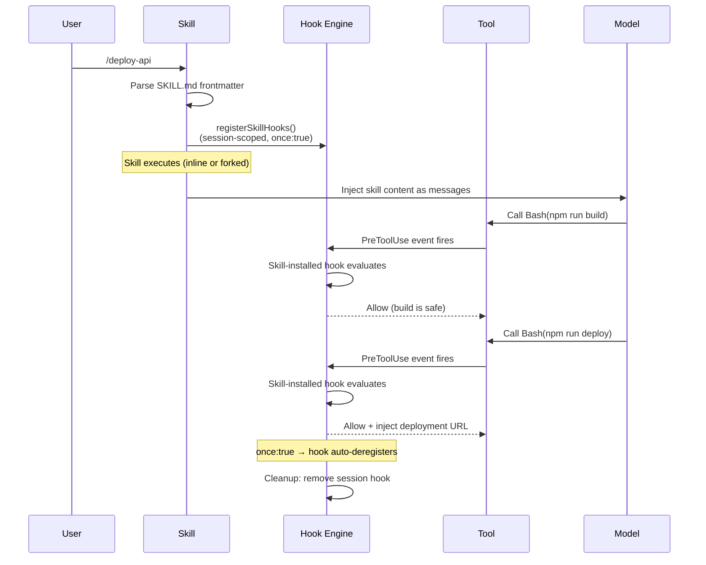
