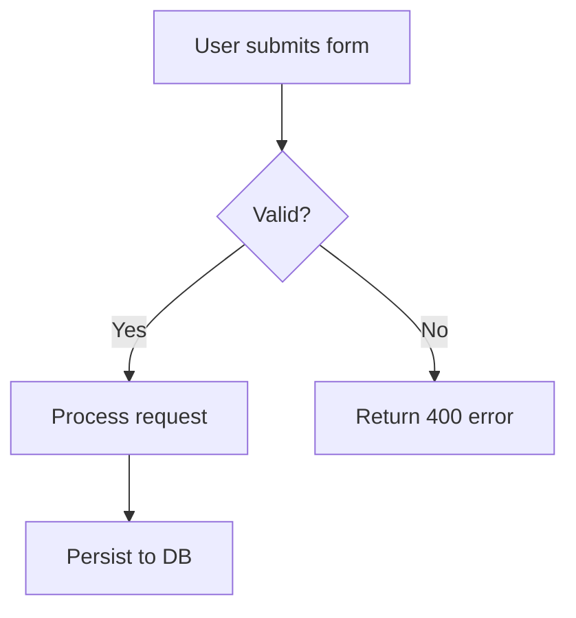
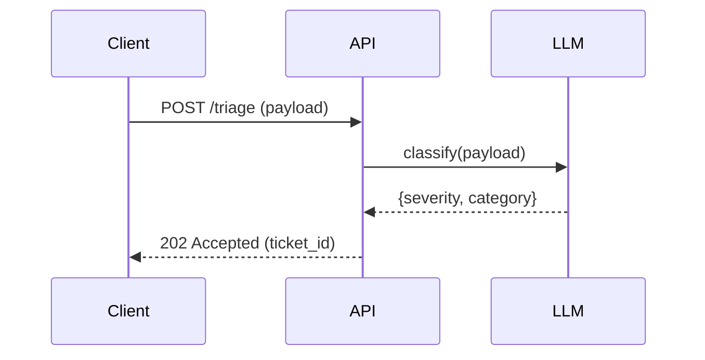
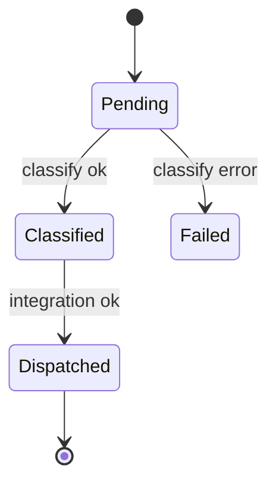
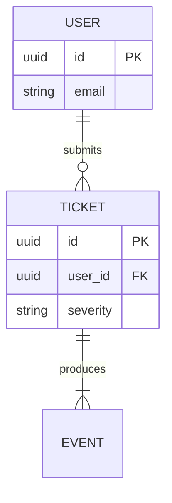
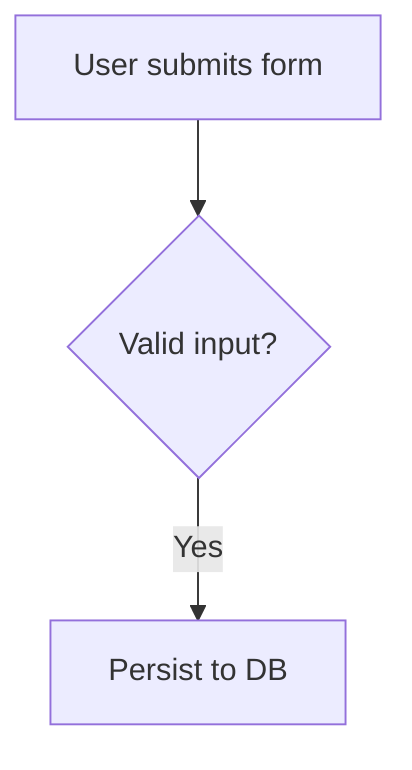

# Gabe Docs — full spec

> This file is the binding spec; the SKILL.md core is a summary.
> E1–E7: see `../../gabe-docs/references/execution-contract.md`.

## Runtime output rendering convention

Gabe Suite spec files (`skills/gabe-*/SKILL.md` + `skills/gabe-*/references/*.md`) document intended output using triple-backtick fences as **visual delimiters for the spec reader**. At runtime these fences are **spec-meta** — do NOT echo them to the user.

When a spec shows a block like:

    ```
    GABE COMMIT — docs-audit
    | # | Sev | Finding | Actions |
    |---|-----|---------|---------|
    | 1 | med | Doc section empty: README.md#Setup | [update-docs] [skip] [defer] |
    → Actions? (e.g., "1:defer 2:skip"):
    ```

…render the contents as **plain markdown**: tables render as tables, inline code with single backticks stays inline, prose stays prose, interactive prompts appear on their own lines. The outer triple-backtick fence is a delimiter for the spec reader, **not** a directive to wrap runtime output in a code block.

Why this matters: when a command like `/gabe-commit docs-audit` echoes the fence literally, Claude Code renders the whole block as monospace code — markdown tables show as raw `| # | Sev | ...` text, the triage table becomes unreadable. The user cannot scan severity columns, click action tokens, or visually parse rows.

**Exception: genuinely-code content.** When the fence content IS actual code or a shell transcript (lines start with `$`, `git`, `bash`, language keywords, JSON, YAML, diff format) AND should appear monospace for copy-paste fidelity → keep fenced at runtime.

Tagged fences like ```bash, ```python, ```json, ```yaml, ```diff are **always** runtime code blocks — render as code at runtime. Only **bare** ``` fences containing markdown (tables, headers, prose with inline backticks, interactive prompts) are spec-meta delimiters to be stripped.

**Decision rule — when in doubt:**

| Fence content | Runtime behavior |
|---|---|
| Markdown table (`\| ... \|` rows) | Strip fence, render as markdown table |
| Interactive prompt with `→` or `[action]` tokens | Strip fence, render as prose + inline code |
| Heading / bullet list / mixed prose | Strip fence, render as markdown |
| Shell transcript (`$ command` / `>>> expr`) | Keep fenced, render as code block |
| YAML / JSON / diff / SQL / code in any language | Keep fenced (prefer tagged fence) |
| Mermaid diagram body | Keep fenced with ` ```mermaid ` — always code |

Commands/skills that produce user-facing triage tables (`/gabe-commit`, `/gabe-commit docs-audit`, `/gabe-review`, `/gabe-teach`, `/gabe-assess`, `/gabe-roast`, `/gabe-push`) MUST apply this convention. A one-line inline reminder sits in each affected spec header.

## Three load-bearing rules

1. **CommonMark strict.** No Setext, no ambiguous indented code blocks, no mixed list markers.
2. **No time estimates.** Never write "30 min", "2-4 hours", "reading time: 5min" unless the user explicitly asks. Time varies per project/team; estimates rot.
3. **Analogy first, then the thing.** Every well doc opens with the quoted one-liner from `KNOWLEDGE.md`. Every architectural explanation leads with the mental model, then the mechanism.

## HTML review artifacts for complex plans

Markdown and KDBP files remain canonical. HTML review artifacts are allowed when a Gabe command explicitly owns them, currently `/gabe-plan` for complex planning and phase-modeling work. The HTML file is the human-facing entrypoint for dense decisions; `.kdbp/PLAN.md`, `.kdbp/DECISIONS.md`, and `.kdbp/LEDGER.md` remain the automation source of truth.

Required standard:

- Write a single self-contained `.html` file with inline CSS and inline SVG/HTML diagrams.
- Use no network dependencies, no remote fonts, no remote scripts, and no dev server requirement.
- Keep visual scale consistent: cards, tables, diagrams, side navigation, section widths, and spacing should feel like one document system.
- Include this banner text exactly: `HTML review artifact; .kdbp/PLAN.md and .kdbp/DECISIONS.md remain canonical.`
- Include provenance: generated date, command name, canonical Markdown paths, decision range, and ledger entry.
- Include a visible `Detail paths`, `More detail`, or equivalent section that links or points to the Markdown/README files containing deeper details for each major HTML section. HTML is the review entrypoint; critical detail still belongs in canonical docs and must be easy to find from the artifact.
- Prefer inline SVG for diagrams that must render directly from disk. Mermaid may be included as source text only when the document also provides a rendered/static equivalent.
- Do not write Gabe Plan HTML artifacts under `docs/mockups/**/*.html`; that path belongs to mockup/reference workflows.

Use HTML artifacts for complex phase plans, domain/data modeling, workflow traces, architecture decisions, migration plans, and user-requested visual planning summaries. Do not create them for routine one-file or low-context tasks unless the user explicitly asks.

## CommonMark essentials

- **Headers:** ATX only (`#`, `##`, `###`). Single space after `#`. No trailing `#`. Never skip levels.
- **Code blocks:** fenced with language tag (```python, ```sh, ```yaml). Never indented blocks.
- **Lists:** one marker style per list (`-` throughout, or `*`, or `+`). Blank line before/after.
- **Links:** inline `[text](url)` or reference style. No bare URLs without `<>`.
- **Emphasis:** `**bold**`, `*italic*`. Pick one style per doc, stay consistent.
- **Line breaks:** blank line between paragraphs. Single `\n` is ignored.
- **Frontmatter:** YAML, opening/closing `---`, only when the document type expects it.

## Mermaid diagrams: valid syntax required

Rules:

1. Always specify diagram type on first line inside the fence.
2. Use Mermaid v10+ syntax.
3. Keep focused: **5-10 nodes ideal, 15 maximum.** If you need more, split into multiple diagrams.
4. Label nodes with intent, not just names (`Classify[Cheap classifier]`, not `A`).

### Diagram type selection

| Diagram type | Best for | Use when |
|--------------|----------|----------|
| `flowchart` | Process flows, decision trees, data-flow overviews | Showing how data/control moves through a stage |
| `sequenceDiagram` | API interactions, message flows, request/response | Multiple actors exchanging messages over time |
| `stateDiagram-v2` | State machines, lifecycle stages, status transitions | An entity moves through discrete named states |
| `erDiagram` | Database schemas, entity relationships | Showing tables + FKs + cardinality |
| `classDiagram` | Object models, class hierarchies, interfaces | Typed system with inheritance or composition |
| `gitGraph` | Branch strategies, release flows | Explaining version-control conventions |

### Syntax templates

**Flowchart** (data/control flow):

````markdown

````

**Sequence** (interaction flow):

````markdown

````

**State** (lifecycle):

````markdown

````

**ER** (data model):

````markdown

````

## Per-doc-type diagram policy

Different doc types have different diagram budgets and triggers. Use this matrix when deciding whether a diagram belongs — and whether it's **required** (commands should propose/block) or **optional** (author's call).

| Doc type | Diagram budget | Required when | Commands that enforce |
|----------|----------------|---------------|-----------------------|
| `docs/wells/*.md` | 1 primary per well | ≥2 verified topics in the well (stub no longer acceptable) | `/gabe-commit docs-audit` Step A3 (`upgrade-diagram`); `/gabe-teach` topic-append post-verify |
| `docs/AGENTS_USE.md` | 1 flowchart (agent loop) + 1 sequenceDiagram (tool-call pattern) | `## Agent Design` section has >100 non-comment chars AND agent module has ≥2 files | `/gabe-commit` CHECK 7 Layer 2 + docs-audit |
| `docs/architecture.md` | 1 overview flowchart; +1 erDiagram if Data Model section exists; +1 sequenceDiagram if API Endpoints section exists | Section populated (>80 chars) | `/gabe-commit docs-audit` Step A2 |
| `docs/architecture-patterns.md` | 1 diagram per pattern entry, scoped | Pattern adds a flow / state / structure (skip pure-rationale patterns) | `/gabe-teach arch-append` |
| ADRs / `docs/decisions/*.md` | Optional; 1 when decision is about a flow, state machine, or structural split | Author judgment | none (suggestion only) |
| `README.md` | Optional; at most 1 high-level flowchart | Text can't express a multi-hop flow | none |
| `docs/wells/*.md` inline (within a verified topic) | Optional; triggered by complexity signals (see below) | `/gabe-teach` post-verification complexity heuristic fires | `/gabe-teach` offers `[add-dedicated-diagram]` after user answers questions |

**Budget rationale:** one well-chosen diagram beats three marginal ones. Over-diagramming bloats docs and decays — every diagram is a maintenance debt.

## Inline explanatory diagram triggers (beyond section-level)

Add a dedicated diagram inside a topic block, ADR body, or mid-doc prose when ANY of:

1. **Multi-hop journey** — request/data/call touches ≥3 layers (e.g., UI → API → pipeline → LLM → integration)
2. **State transitions ≥3 states** — lifecycle not expressible in a single sentence
3. **Concurrent/async behavior** — ordering matters and prose can't express it
4. **Concept describes a flow, not a rationale** — WHY topics are usually pure prose; WHEN/WHERE often benefit from a picture
5. **User explicitly asks** — "how does X connect to Y?" style question in verification answer

**Skip diagrams for:** one-liner config changes, pure-rationale ADRs, simple lookup patterns, single-function refactors.

This trigger set is consulted by `/gabe-teach` after topic verification: if the user's answer + topic metadata matches ≥1 trigger, the command offers `[add-dedicated-diagram] [skip] [defer]`.

## Per-well diagram recommendations

When scaffolding a well doc (`/gabe-teach init-wells` Step 2e), pick the diagram type whose question matches the well's dominant question. One diagram per well is usually enough. Add more only when the well genuinely covers multiple questions.

| Well type (by name/description) | Primary diagram | Question it answers |
|---------------------------------|-----------------|---------------------|
| Guardrails / Validation / Safety | `flowchart` | "What happens to a request as it flows through validation?" |
| LLM Pipeline / Orchestration / Agent | `flowchart` + `stateDiagram-v2` | "How does data flow?" + "What states does a run pass through?" |
| API Layer / HTTP / Endpoints | `sequenceDiagram` | "Who talks to whom, in what order?" |
| Data Model / Schema / Persistence | `erDiagram` | "What entities exist and how are they related?" |
| Integrations / Adapters / Outbound | `sequenceDiagram` | "What calls go to the external service and when?" |
| Frontend / UI / Client | `flowchart` | "How does a user navigate from X to Y?" |
| Observability / Monitoring / Metrics | `flowchart` | "How does a signal flow from code to dashboard?" |
| Other / Uncategorized | `flowchart` (default) | Generic process flow |

Matching heuristic (case-insensitive substring match on the well name or description):

- `api`, `http`, `endpoint`, `route` → sequenceDiagram
- `data`, `schema`, `model`, `db`, `persistence`, `migration` → erDiagram
- `state`, `lifecycle`, `pipeline`, `orchestration` → stateDiagram-v2 (or flowchart if pipeline has branches)
- `integration`, `adapter`, `webhook`, `client`, `outbound` → sequenceDiagram
- default → flowchart

## Analogy-first opener convention (gabe-lens specific)

Every well doc opens with three lines, in this exact order:

```markdown
# [Well Name] — [Analogy in quotes]

> [Description sentence from KNOWLEDGE.md]

**Paths:** [Paths globs from KNOWLEDGE.md]
```

The analogy is NOT a tagline — it's the mental-model anchor the reader uses to orient themselves before reading mechanism. Keep it in double quotes exactly as stored in `KNOWLEDGE.md` (5-15 words, from `gabe-lens` oneliner mode).

When a reader skims the doc, they should leave with the analogy in their head even if they read nothing else. Everything below is detail in service of the analogy.

## Well doc template

This is the template scaffolded by `/gabe-teach init-wells` Step 2e and `/gabe-teach wells → [docs N]`:

```markdown
# [Well Name] — "[analogy]"

> [description]

**Paths:** [paths]

<!-- Standards: see ~/.claude/skills/gabe-docs/SKILL.md -->

---

## Purpose

<!-- 2-3 sentences: what this section of the application does and why it exists. -->
<!-- Populated manually by the human, or auto-appended from verified /gabe-teach topics. -->

## Key Decisions

<!-- Load-bearing choices for this well. Each entry: date + one-line title + 1-2 paragraph rationale. -->
<!-- Example:
### 2026-04-15 — Guardrails run before the LLM, not after
Reasoning: ...
-->

## Key Diagrams

<!-- Pick diagram type based on well dominant question. See gabe-docs SKILL.md per-well table. -->
<!-- Suggested for this well: [DIAGRAM_TYPE] -->
<!-- Replace placeholder with real diagram once the flow stabilizes. -->

```mermaid
[PLACEHOLDER_DIAGRAM]
```

## Topics (auto-appended)

<!-- /gabe-teach topics appends verified topic summaries here on first run. -->
<!-- Do not edit the structure below this line; edit individual entries freely. -->
```

The scaffolder substitutes `[DIAGRAM_TYPE]` (from the per-well recommendation table) and `[PLACEHOLDER_DIAGRAM]` (a minimal valid skeleton of that type — e.g., `flowchart TD\n    A[Start] --> B[TODO]`). The placeholder is intentionally crude so a human replaces it; do NOT over-invest in auto-generated diagrams.

## Upgrading a placeholder diagram

A stub diagram (contains `TODO`, `[Start] --> B`, or fewer than 3 labeled nodes) is a **debt signal**, not a finished diagram. Commands that touch well docs upgrade the stub when a trigger fires — they don't overwrite human-authored diagrams.

**Upgrade detection heuristic (deterministic, zero LLM cost):**

A `## Key Diagrams` section contains a **stub** when ALL of the base conditions hold:

1. Mermaid fence exists
2. First non-blank line inside fence matches `^\s*(flowchart|sequenceDiagram|stateDiagram-v2|erDiagram|classDiagram|gitGraph|mindmap)` (diagram type declared)

AND ANY of the stub signals fire:

| # | Signal | Detection |
|---|---|---|
| a | Literal `TODO` | Case-insensitive substring match in fence body |
| b | Scaffolder placeholder labels | Body contains `[Start]` OR `[End]` OR `[TODO]` as literal node labels |
| c | Degenerate node count | ≤2 distinct node/participant tokens in the body (truly trivial — not a real diagram) |
| d | Undersized body | Fence body <60 chars of non-whitespace non-comment content |

A legitimate 3-node diagram with intent-labeled nodes — e.g.:

````

````

...passes ALL four stub signals (no `TODO`, no `[Start]`/`[End]`, 3 distinct nodes `Submit`/`Validate`/`Store`, body >60 chars) and is **not** flagged. The threshold sits intentionally between the scaffolder's generated stub (`A[Start] --> B[TODO]` — 2 nodes, contains both `[Start]` and `[TODO]`) and the minimum viable authored diagram (3 intent-labeled nodes).

**Node counting for signal (c):** count distinct identifiers on the left of `-->`, `---`, `->>`, `-->>`, `o--o`, `||--o{`, and other Mermaid edge operators. For `sequenceDiagram`, count distinct `participant` declarations OR distinct message senders/receivers. For `erDiagram`, count distinct entity names. For `stateDiagram-v2`, count distinct state names (excluding `[*]`).

**Rationale:** the prior "≤3 distinct node tokens" heuristic false-positives on valid minimal diagrams. The tightened version catches scaffolder placeholders explicitly (signal b) and reserves the node-count signal for truly degenerate cases (≤2 nodes).

**Upgrade triggers:**

- `/gabe-commit docs-audit` Step A3 — flags `Well [N] diagram still placeholder despite [M] verified topics` at `low` severity when stub detected AND verified topics ≥2. Action: `upgrade-diagram`.
- `/gabe-teach` topic-append — after appending the 2nd verified topic to a well, offer `[upgrade-diagram]` prompt if stub still present.

**Generation rules for the upgrade (LLM-assisted):**

1. Diagram type comes from the per-well recommendation table (never re-decide at upgrade time — respect author intent from scaffold).
2. Content synthesized from the well's verified topics in `KNOWLEDGE.md` + Key Decisions section + Purpose section. No external research.
3. Hard cap at **10 nodes**. If the well genuinely needs more, split into two diagrams under `## Key Diagrams` with H3 subtitles.
4. Label nodes with intent, not codenames (`Classify[Cheap classifier]` not `A`).
5. Keep the analogy anchor from the well title in mind — the diagram should read as the same story as the analogy.

## Rich patterns → `../diagrams-library.md`

When the minimal skeletons in this file aren't enough, consult `../diagrams-library.md` (co-located one level up, in the skill root). It contains 14 advanced Mermaid patterns with subgraphs, styling, multi-layer composition, sequence diagrams with `alt` branches, state machines with notes, and mindmaps for taxonomies.

**When to reach for the library:**

- Diagram needs ≥3 actors / layers / subgraph groups
- Reader must see hierarchy (user → project → directory config; L1 → L5 defense-in-depth)
- Flow has parallel branches or conditional modes (router patterns, `alt` blocks)
- Color legend helps reader parse categories at a glance

**When to stay with SKILL.md skeletons:**

- Scoped single-flow diagrams (most well docs)
- ≤7 nodes
- Single-actor sequence
- Simple state machine (≤4 states)

Pull **composition ideas** from the library — not domain content. The library examples use Brownbull/Claude-agent domain terms; treat as placeholder structure.

## Writing rules (gabe-generated docs)

- **Active voice, present tense.** "The classifier routes by severity" not "The classifier will route by severity".
- **Second person.** "You can override" not "Users can override".
- **Task-oriented.** Every section answers a "how do I…" or "why did we…" question, not "what does this class do".
- **One idea per sentence.** Split compound sentences.
- **Examples after explanations.** Rationale first, snippet second.
- **Accessibility.** Descriptive link text (not "click here"), alt text for diagrams (describe what the diagram shows in one sentence before the fence).

## Quality checklist (for auto-append and handwritten additions)

Run this checklist BEFORE any Write/Edit of a gabe-generated doc and emit one result line: `docs-check: clean` or `docs-check: failed <item-ids> — fixed`. A doc written without a docs-check line has not been checked.

- [ ] CommonMark compliant (no violations)
- [ ] No time estimates
- [ ] Headers in proper hierarchy
- [ ] Code blocks have language tags
- [ ] Links have descriptive text
- [ ] Mermaid diagrams use type from the recommendation table (or document why an alternative was chosen)
- [ ] Diagrams are ≤15 nodes
- [ ] Active voice, present tense, second person
- [ ] Analogy-first opener preserved (never delete the `# Title — "analogy"` line)

## When in doubt

Precedence:

1. Project-specific standards in `.kdbp/` (if present — rare)
2. This skill (`gabe-docs`)
3. CommonMark spec

Do not invent new conventions without updating this skill file.
