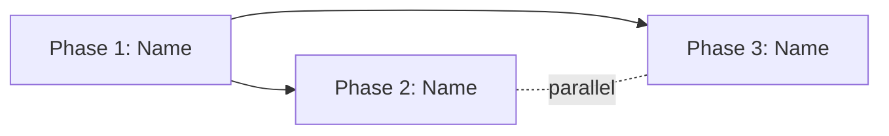

# Gabe Scope — full spec (re-homed)

> Re-homed verbatim from `commands/gabe-scope.md` (B2 skills-only migration, 2026-07-09;
> one personal-path rule removed — see migration log). This file is the binding spec;
> the SKILL.md core is a summary. E1–E7: see `../../gabe-docs/references/execution-contract.md`.

The backbone authoring command. Produces two linked artifacts for a new project:

1. **`.kdbp/SCOPE.md`** — high-inertia premise. Problem, users, success criteria, requirements, constraints, posture. Changes only through `/gabe-scope-change`.
2. **`.kdbp/ROADMAP.md`** — medium-inertia phase plan. Derived from SCOPE.md. Changes as phases complete, split, or get inserted.

**Design principles** (see `docs/gabe-scope-design.md` for full spec):
- **Strict checkpoint gating.** Every step ends with explicit user approval before the next runs. No auto-ship mode.
- **Pause anywhere.** Session state persists to `.kdbp/scope-session.json` + in-file `[PENDING APPROVAL]` markers. Days-later resume works.
- **Reference Frame first.** Existing standards (AI stack docs, engineering practices, compliance frameworks) declared at Step 0.5 and threaded into every reasoning call.
- **Brainstorm on idea-quality answers.** If the intake evaluator flags an answer vague/hedged, the Socratic analyst sub-loop offers 2–3 framings with explicit tradeoffs. Hard 2-cycle cap.
- **Goal-backward success criteria.** Observable user truths, not implementation tasks.
- **100% coverage invariant.** Every SC covered by ≥1 REQ; every REQ maps to exactly one Phase. Finalize blocks otherwise (with documented `--force` escape).

**This command delivers the full 8-step workflow** (Steps 0 through 8 + pre-flight Step 0 + Reference Frame Step 0.5).

> **Rendering note.** Output templates in this spec wrapped in bare triple-backtick fences are spec-meta delimiters — render their contents as plain markdown at runtime (dashboards, candidate lists, prompts, next-step menus). Tagged fences (```bash, ```yaml, ```jsonl, ```mermaid, ```markdown) stay fenced because they are literal file contents or commands. See `gabe-docs/SKILL.md` § "Runtime output rendering convention".
>
> **Behavioural rule at runtime:** when presenting dashboards, candidate lists, menus, prompts, or next-step blocks to the user, NEVER emit a bare `` ``` `` fence around them. Those UI surfaces must render as markdown (headings, tables, bullet lists, inline code). If an example in this spec uses indentation that looks like preformatted text (e.g., 2-space-indented lines), re-express it as a markdown table or bulleted list — do not preserve the indentation by wrapping in a code fence. Only use fenced blocks when emitting literal file contents, shell commands, JSON payloads, or Mermaid diagrams, and always tag the language (```bash, ```yaml, ```jsonl, ```mermaid, ```markdown, ```text).

## Procedure

### Step 0: Re-invocation check (pre-flight)

Runs only if `.kdbp/SCOPE.md` or `.kdbp/scope-session.json` already exists. Otherwise proceed to Step 0.5.

Parse `$ARGUMENTS` for flags: `--resume` forces resume path; `--start-over` forces fresh with typed-confirm.

**Case matrix:**

| SCOPE.md | session.json | Behavior |
|---|---|---|
| absent | absent | Proceed to Step 0.5 fresh |
| absent | present | Prompt: **R**esume (default) / **S**tart-fresh (archive session as tombstone) / **A**bort |
| present | absent | Prompt: **C**ontinue-to-planning (run `/gabe-plan`) / **H**ange-scope (run `/gabe-scope-change`) / **S**tart-over (typed confirm, archive SCOPE.md + ROADMAP.md) / **A**bort |
| present | present | Same as row above + resume option for session |

**Start-over flow:**
1. Emit one-line summary of what will be archived: "`SCOPE.md v1 (created 2026-04-21) + ROADMAP.md v1 + scope-references.yaml will move to .kdbp/archive/.` Type `start over` to confirm."
2. On typed confirm (exact match, case-insensitive), `mkdir -p .kdbp/archive/tombstones/{timestamp}/` and `mv` SCOPE.md + ROADMAP.md + scope-references.yaml + scope-session.json into it.
3. Never delete. Tombstones are permanent audit trail.

**Resume flow:**
1. Read `scope-session.json`. Validate against `schemas/scope-session.schema.json`.
2. Check `command_version` matches current command version. Mismatch → stop with: "Session created under `/gabe-scope v{X}`; current is v{Y}. Resume may produce inconsistent results. Options: (a) `--force-resume` (accept risk), (b) start fresh (archives session). Recommend: fresh."
3. Announce resumed step: "Resuming at Step {N} ({name}). Last update: {timestamp}."
4. Jump to that step.

### Step 0.5: Reference Frame Setup

Runs on fresh scope only (skipped on `--resume` if frame was already loaded).

**Flow:**

**(a) Auto-suggest candidates.** Deterministic filesystem scan — no LLM yet. Scan these locations for markdown + YAML files:

```bash
./docs/ ./_docs/ ./specs/ ../docs/
~/.claude/rules/ ~/.claude/skills/
# Parent-project .kdbp/ if present
```

For each candidate, extract first `#` heading or first non-blank line as preview.

**Present as a markdown table — DO NOT wrap in triple-backtick fences.** Paths go in inline backticks so they render monospace inside the table cell, not as a preformatted block. If the scan hits a lot of candidates, group under `###` sub-headings by scan location (e.g., `### ./docs/`, `### ~/.claude/rules/common/`) with one table per group.

Example output layout (rendered markdown, not fenced):

### ~/.claude/rules/common/

| # | Path | Preview |
|---|------|---------|
| 1 | `~/.claude/rules/common/coding-style.md` | Immutability, file size, error handling |
| 2 | `~/.claude/rules/common/testing.md` | 80% coverage, TDD workflow |

### ./docs/

| # | Path | Preview |
|---|------|---------|
| 3 | `./docs/architecture-patterns.md` | Project-level patterns ledger |

**Pick:** `a <N>` to add one (default weight `s` / load `auto`) · `bulk-add <range>` to add multiple · `s` to skip · `m` for manual entry · `done` to proceed.

**Runtime invariant:** when you surface this list, emit real markdown (headings + tables + inline-code paths). Never wrap the list in a bare `` ``` `` fence — that collapses it into a monospace code block in the UI and loses the table rendering.

**(b) Manual entry.** For refs not surfaced by auto-scan, prompt:

Enter ref:
  - path  : `<absolute local path | relative path | URL>`
  - role  : one-line purpose, mandatory
  - weight: `[a]` authoritative (hard constraint) / `[s]` suggestive (soft default) / `[c]` contextual (framing only) — default `s`
  - load  : `[f]` full_read / `[i]` index_only / `[z]` summarize (cached) — default based on file size (>3k tokens → summarize or index_only)

For `summarize` mode, invoke Sonnet via `prompts/reference-summarizer.md`. Cache summary to `scope-references.yaml`.

**(c) Confirm + write.** Display final frame. User approves → write to `.kdbp/scope-references.yaml`. Validate against `schemas/scope-references.schema.json` — reject on schema failure.

**Empty frame is valid.** `No references declared. Proceeding without framing block — all reasoning will be from intake + research only. Confirm? [Y/n]`

**Checkpoint 0.5:** Reference Frame committed. session.json updated: `reference_frame_loaded: true`, `current_step: step-1-intake`.

### Step 1: Intent Capture (variable-depth interview)

**Model:** Opus throughout (intake-quality-evaluator + brainstorm-analyst + intake-summary-assembler)

**Flow — 5 core questions + up to 10 follow-ups:**

| # | Focus | Question |
|---|-------|----------|
| Q1 | one-liner | In one sentence, what are you building? |
| Q2 | primary user | Who hurts the most from not having this, and what are they doing today instead? |
| Q3 | why now | What changed in the world or your context that makes this buildable or necessary now? |
| Q4 | success shape | In 6 months, if this works, what's different? (observable, not aspirational) |
| Q5 | anti-vision | What would you refuse to build, even if users asked? |

User can type `skip` on any core question (records to Open Questions) or `pause` (saves session.json, exits command).

**Per-answer routing** (after each user reply):

1. Build input bundle: `{question, answer, prior_answers, reference_frame}`
2. Invoke `prompts/intake-quality-evaluator.md` (Opus). Get back `{quality, signals, gap_opened, gap_question, reference_conflict, notes}`.
3. Branch on `quality`:
   - **spec** → accept answer, advance to next question. If `gap_opened`, push `gap_question` onto follow-up queue.
   - **idea** → enter brainstorm sub-loop (§1.5 below).
4. If `reference_conflict.ref_id` set → surface conflict now (see **Conflict-surfacing** §).

**Follow-up cap:** max 10 signal-triggered follow-ups per session across all core questions. Track in `session.json.intake.follow_ups_asked`. When cap hit, announce: "Follow-up budget exhausted. Remaining gaps route to Open Questions."

#### §1.5 Brainstorm Sub-loop

Invoked only when `intake-quality-evaluator` returns `quality: idea`. Hard cap 2 cycles per question; enforced by reading `session.json.intake.brainstorm_cycles[question_id]`.

**Cycle N:**
1. Invoke `prompts/brainstorm-analyst.md` with `{question, answer, signals, cycle: N, prior_answers, reference_frame}`.
2. Render the analyst's acknowledgment + 2–3 framings (with gains/gives_up each) + probing question.
3. User options: `A`/`B`/`C` to pick a framing, `refine: <text>` to combine/modify, `reject` to reject all.
4. Incrementing logic:
   - **Pick / refine** → convert to spec-quality answer, return to main flow, mark `brainstorm_exit: false`.
   - **Reject** + cycle < 2 → increment cycle, re-invoke with same inputs + `cycle: 2`.
   - **Reject** + cycle == 2 → write to §14 Open Questions with `[UNRESOLVED — brainstorm exit]`, mark `brainstorm_exit: true`, advance to next core question.

Never exceed cycle 2. If the command somehow reaches a third invocation, abort with schema validation error (session.json cap catches this).

#### §1.end Summarize intake

After Q5 answered (or skipped) and follow-up queue drained:

1. Invoke `prompts/intake-summary-assembler.md` (Sonnet) with full `{interview_answers, brainstorm_results}`.
2. Render the structured summary.
3. **Checkpoint 1:** User reviews. Options: `approve`, `revise: <field>=<value>`, `abort`.
4. On approve, write summary to session.json + advance `current_step` to `step-2-research`.

### Step 2: Research fan-out + synthesis

**Model:** Sonnet for research agents; Opus for synthesis.

**(a) Research width prompt.** Before spawning:

Research width (default: **standard**):

- `[q]` Quick — 2 agents: domain + pitfalls — ~$0.05, ~1 min
- `[s]` Standard — 4 agents: + stack, user-patterns — ~$0.10, ~2 min  **[default]**
- `[d]` Deep — 5-6 agents: + integrations, competitive — ~$0.20, ~3 min

User picks. Save to `session.json.research_width`.

**(b) Parallel fan-out.** Spawn agents via Task tool. Each writes to `.kdbp/research/{name}.md`:

| Agent | Scope | Width |
|---|---|---|
| domain | Similar products, what they got right/wrong | all |
| pitfalls | Known failure modes; post-mortem patterns | all |
| stack | Common tech choices; version-specific gotchas | standard+ |
| user-patterns | Onboarding, retention, engagement patterns | standard+ |
| integrations | Expected-partner APIs, webhooks, auth | deep |
| competitive | Competitors + positioning analysis | deep |

**(c) Synthesis.** Opus reads all research files + intake summary + reference frame. Writes `.kdbp/research/SUMMARY.md` with opinionated recommendations. Include token/cost counter.

**Checkpoint 2:** User reviews SUMMARY.md only (not raw agent outputs). Options: approve / request-additional-agent `<name>: <scope>` / abort. Approve advances.

### Step 3: Problem + Vision draft (§§1–3 of SCOPE.md)

**Model:** Opus. Single LLM call.

**Inputs:** `{intake_summary, research_summary, reference_frame}`.

**Outputs:** Draft markdown for SCOPE.md §1 (One-liner), §2 (Problem), §3 (Vision / North Star). Use template at `templates/SCOPE.md` — match exact section headings and anchor format.

**Write procedure:**
1. Read `.kdbp/SCOPE.md` if exists (partial draft from prior resumed step); else start from template.
2. Replace §1–3 content with generated draft.
3. Append `[PENDING APPROVAL — step-3]` marker immediately after §3's content.
4. Push marker entry to `session.json.pending_approval_markers`.

**Checkpoint 3:** User reviews SCOPE.md §1–3 in-file. Can edit directly — the marker tells the command which region is pending. On approve, remove marker + advance.

### Step 4: Users + Non-Users draft (§§4–6)

**Model:** Sonnet. One primary call; Opus escalation only if non_users empty.

**Inputs:** `{intake_summary, research_summary, reference_frame}`.

**Output contract from `prompts/users-and-non-users-drafter.md`:**
- `primary_user.role`, `.description`, `.jtbd` (≥1 entry, "When I...I want to...so I can..." format)
- `secondary_users` (optional array)
- `non_users` (≥2 entries, non-empty)

**Escalation:** if Sonnet returns `non_users: []` or `len < 2`, re-invoke with Opus using the same prompt + instruction "enumerate ≥3 likely non-user segments the user can refine."

**Write:** draft into §4–6 with `[PENDING APPROVAL — step-4]` marker. Checkpoint 4 approve-or-revise-or-abort.

### Step 5: Success Criteria + Non-Goals draft (§§7–8)

**Model:** Opus. Two calls.

**Highest-friction checkpoint by design** — this is the sign-off on *what counts as success*.

**(a) Success criteria.** Invoke `prompts/success-criteria-generator.md` with `{intake_summary, research_summary, reference_frame, primary_user, problem_statement}`.

Output: 3–10 SCs, each with `{id: SC-NN, statement, why, ref_conflict}`. Statement begins "A user can " and contains a bound.

**(b) Non-goals.** Invoke `prompts/non-goals-generator.md` with `{intake_summary, success_criteria, reference_frame, primary_user, non_users}`.

Output: 2–8 NGs, each with `{id: NG-NN, statement, rationale}`. Statement begins "We will not ".

**(c) Render + conflict check.** Write both sections to SCOPE.md with per-entity anchors (`{#sc-NN}`, `{#ng-NN}`). For each SC whose `ref_conflict.ref_id` is set → surface conflict prompt (see **Conflict-surfacing** §).

**Checkpoint 5:** approve / revise-SC `<id>` / revise-NG `<id>` / abort. Brainstorm sub-loop may fire on revise if user's revised answer is idea-quality.

### Step 6: Constraints + Architecture Posture draft (§§9–10)

**Model:** Sonnet. One call. Brainstorm only fires on revise if user-provided edits are idea-quality.

**Inputs:** `{intake_summary, research_summary, reference_frame, success_criteria}`.

**Output contract from `prompts/constraints-and-posture-drafter.md`:**
- `constraints`: tech_stack, budget, timeline, regulatory, team_size, infra (nulls for unknown, not omitted)
- `architecture_posture`: synchrony, topology, data_gravity, deployment_target, integration_surface

**Conflict check.** Before rendering, Opus-evaluate each authoritative ref entry against the draft constraints + posture. Any conflicts → 3-option conflict prompt (see **Conflict-surfacing** §).

**Write:** §9 table + §10 bullets with `{#constraints}` + `{#architecture-posture}` anchors. Marker `[PENDING APPROVAL — step-6]`.

**Checkpoint 6:** approve → advance `current_step: step-7.1-requirements`.

### Step 7: Requirements → Phase Split → Roadmap (hybrid, per D6)

Step 7 has four sub-steps with two user checkpoints sandwiched. This is the most complex step — the one decomposing success into shippable units.

#### Step 7.1 — Requirements generation

**Model:** Opus. One call.

Invoke `prompts/req-decomposer.md` with `{success_criteria, architecture_posture, constraints, reference_frame}`.

**Output contract:** `{requirements[], coverage_check{scs_covered, scs_uncovered}, notes}`. Each REQ has `{id: REQ-NN, name, description, covers_sc[], acceptance_signal}`.

**Coverage check (deterministic post-LLM):** verify every SC from §7 has ≥1 REQ in `covers_sc`. If `scs_uncovered` is non-empty:

⚠ Coverage incomplete: SCs without REQs: {SC-02, SC-05}

Options:
- `[r]` Regenerate — ask Opus to produce REQs covering missing SCs
- `[a]` Add REQ manually — enter REQ text + which SCs it covers
- `[f]` `--force` — finalize with gap; records `finalize_forced_at` in session.json
- `[b]` Back — revise SCs instead (returns to Step 5)

**Write:** draft §12 with `{#req-NN}` anchors and coverage matrix table. Marker `[PENDING APPROVAL — step-7.1]`.

**Checkpoint 7.1:** REQ list approved + every SC covered. Session state: `coverage_status.scs_without_reqs: []` required.

#### Step 7.2 — Phase split options (per D5)

Zero LLM. Pure prompt:

How should we split into phases?

- `[c]` Coarse — 3-5 phases, milestone-sized
- `[s]` Standard — 5-8 phases, sprint-sized  **[default]**
- `[f]` Fine — 8-12 phases, iteration-sized
- `[N]` Custom — enter integer N between 2 and 20

Pick:

Save to `session.json.granularity` (+ `custom_granularity_count` if custom).

#### Step 7.3 — Phase skeleton

**Model:** Opus. Mode: `skeleton`.

Invoke `prompts/phase-skeleton-and-populator.md` with `{mode: skeleton, success_criteria, requirements, granularity, architecture_posture, reference_frame}`.

**Output:** phases array with `{id, name, goal, why}` only. No depends_on / parallel_with / covers_reqs yet.

**Runtime phase-count check** (rubric doesn't catch this — P3.5 finding): verify `len(phases)` matches declared granularity range:

| Granularity | Expected count |
|---|---|
| coarse | 3–5 |
| standard | 5–8 |
| fine | 8–12 |
| custom N | exactly N (±1 tolerance) |

Mismatch → announce and offer options:

⚠ Skeleton returned 4 phases; standard granularity expects 5-8.

Options:
- `[r]` Regenerate — re-prompt with explicit count hint
- `[a]` Accept anyway — proceed with 4 phases
- `[c]` Change granularity — back to Step 7.2

**Write:** draft §3 Phase Detail sections of ROADMAP.md with `{#phase-N}` anchors. Each phase section has Name, Goal, Why paragraph. Status `pending`. Depends-on / Parallel-with / Covers REQs fields present but empty `—`. Marker `[PENDING APPROVAL — step-7.3]`.

**Checkpoint 7.3:** user reviews skeleton. Can edit name/goal/why in-file. Can request regen with different granularity. On approve, advance.

#### Step 7.4 — Populate skeleton

**Model:** Opus. Mode: `populate`.

Invoke same prompt with `{mode: populate, skeleton: approved_skeleton, requirements}`.

**Output:** phases now include `depends_on`, `parallel_with`, `covers_reqs` + `coverage_check{reqs_covered, reqs_uncovered, reqs_duplicated}`.

**Coverage check (deterministic):**
- Every REQ must appear in exactly one phase's `covers_reqs`. Orphans → `reqs_uncovered`. Duplicates → `reqs_duplicated`.
- If either non-empty → same 4-option prompt as Step 7.1 (r / a / f / b).

**Write:** fill Phase Detail fields + §2 Phase Table at-a-glance + §5 Coverage Matrix. Generate §4 Dependency Graph (Mermaid) deterministically from depends_on + parallel_with columns — no LLM needed:



Marker `[PENDING APPROVAL — step-7.4]`.

**Checkpoint 7.4:** user reviews populated roadmap. Can move REQs between phases, reorder, adjust dependencies. Coverage check re-runs on every edit (deterministic; fast). Approve advances to Step 8.

### Step 8: Finalize

**Model:** Sonnet for assembly. Deterministic for archival + tombstoning.

**(a) Final assembly.** Invoke `prompts/final-assembler.md` with all approved section drafts + `session_metadata`.

**Output:** `{scope_md, roadmap_md, scope_frontmatter, roadmap_frontmatter, validation}`.

Assembly input = the CURRENT on-disk `.kdbp/SCOPE.md` / `ROADMAP.md` — Read both files NOW, immediately before assembly: the user may have edited content outside `[PENDING APPROVAL]` markers, and anything outside markers is FINAL (see marker convention below). Session drafts are fallback only for sections still inside pending markers. Before (b) writes, show the on-disk → assembled diff and get approval (reuse the 8(f) `[s]how diff` affordance) — never overwrite user edits sight-unseen.

**Validation gate:** the `validation` object must show:
- `sc_anchors_present: true`
- `req_anchors_present: true`
- `phase_anchors_present: true`
- `coverage_complete: true`

Any false → abort with specific remediation. Also run the `markdown_anchors_resolve` check (same logic as rubric) on `scope_md` to verify every `[link](#x)` has a `{#x}` definition.

**(b) Write finalized files.**

- `.kdbp/SCOPE.md` — replaces any prior draft
- `.kdbp/ROADMAP.md` — replaces any prior draft

Remove ALL `[PENDING APPROVAL — step-N]` markers. Append `init` row to §15 Change Log and §6 Roadmap Change Log with today's date.

Validate emitted SCOPE.md against the template's expected section order via regex check — section numbering 1→15 must appear in order (§0 Reference Frame only if scope-references.yaml is non-empty).

**(c) Archive research.**

```bash
mkdir -p .kdbp/research/archive/{timestamp}/
mv .kdbp/research/*.md .kdbp/research/archive/{timestamp}/
# research/archive/ preserved permanently — regenerated on pivot
```

**(d) Tombstone session.**

```bash
mkdir -p .kdbp/archive/tombstones/
mv .kdbp/scope-session.json .kdbp/archive/tombstones/scope-session-{timestamp}.json
```

Append tombstone row to `.kdbp/CHANGES.jsonl`:

```jsonl
{"ts":"2026-04-21T14:32:00Z","event":"scope_init","scope_version":1,"roadmap_version":1,"tombstone":".kdbp/archive/tombstones/scope-session-{ts}.json"}
```

**(e) Update KNOWLEDGE.md.** Add or update a "Root artifacts" section pointing to SCOPE.md + ROADMAP.md:

```markdown
## Root artifacts

- [`.kdbp/SCOPE.md`](SCOPE.md) — project premise (stable backbone, changed via `/gabe-scope-change`)
- [`.kdbp/ROADMAP.md`](ROADMAP.md) — phase plan (updated on any `-change`; read by `/gabe-plan`)
```

**(f) Git-commit prompt.** Surface suggested commit message:

Suggested git commit:

```text
feat(scope): initial scope + roadmap for {project name}

Adds .kdbp/SCOPE.md v1 (premise) and .kdbp/ROADMAP.md v1
({phases_total} phases at {granularity} granularity).
Reference Frame: {N} refs declared ({counts by weight}).
```

Options:
- `[c]` Commit now (runs git add + git commit)
- `[s]` Show the diff first
- `[n]` Skip — I'll commit manually

Do NOT auto-push. Do NOT amend prior commits.

**(g) Announce next step.**

Scope authoring complete.

Next:
- `/gabe-plan 1` — decompose Phase 1 into tasks
- `/gabe-scope-change` — if anything needs adjusting (routes to -addition or -pivot)
- `/gabe-teach scope` — learn the scope you just authored (future phase)

**Checkpoint 8:** SCOPE.md frozen. Only `/gabe-scope-change` can modify it from here.

---

## Universal conventions

### Conflict-surfacing (Steps 5, 6)

When an authoritative reference frame entry conflicts with the user's direction, emit:

⚠ Conflict detected

- **Your answer / draft:** {summary of user direction}
- **Authoritative ref:** {ref-id} — {role}
- **Conflicting passage:** {excerpt or summary from ref}

Options:
- `[a]` Accept the ref — align my answer/draft to the ref
- `[o]` Override the ref — record override + rationale in SCOPE.md Change Log
- `[p]` Pause — I need to update the ref file first, then resume

Pick `[a/o/p]`:

On override, append to §15 Change Log a `{date, type: override, ref_id, rationale}` row AND update the ref entry's audit trail in scope-references.yaml with `overridden_at: {timestamp}`.

### session.json writes

The command writes session.json after every successful sub-step. Writes are atomic (write to tmpfile, `mv` into place) to survive crashes mid-checkpoint.

**Minimum writes per step:**
- `last_updated` (always)
- `current_step` (on advance)
- `completed_steps` (append on checkpoint approval)
- `prompt_versions_used` (merge on every LLM call)
- Step-specific payload (intake answers, brainstorm cycles, research_width, pending_approval_markers)

Validate the session.json against `schemas/scope-session.schema.json` after every write. Schema violation = abort with dump of the violating state to stderr.

### In-file `[PENDING APPROVAL — step-N]` markers

Each step's generated content is bracketed by a marker the user sees in their editor. Format:

```markdown
<!-- [PENDING APPROVAL — step-3] generated by /gabe-scope — do not edit the marker manually -->

## 1. One-liner {#one-liner}

{draft content user can edit}

<!-- [/PENDING APPROVAL — step-3] -->
```

On checkpoint approval, the command removes BOTH markers via Edit tool match-and-replace. User can move text outside the markers before approval — anything outside is treated as final.

### LLM call accounting

Accounting is observable-only: after every LLM call, count it (`llm_calls += 1`) and record model names in `session.json.cost_estimate`. Token/US$ figures are estimates the session cannot verify — if token counts are not observable in this harness, write `cost: untracked (N calls)` in session.json and surface "Step 3 complete. LLM calls so far: 7." Never print an invented dollar figure.

### Error handling

| Error | Behavior |
|---|---|
| LLM call fails (network, rate-limit, 5xx) | Retry once with 30s backoff. Second failure → save session.json + exit with remediation message. |
| LLM returns non-conformant output (JSON parse fail, required field missing) | Retry once with "your previous response violated {X} — regenerate". Second failure → surface raw output + abort. |
| User types invalid checkpoint response | Re-prompt with allowed options. Don't advance. |
| session.json schema validation fails after write | Dump violating state to stderr. Do not lose user work — the current draft in SCOPE.md remains. |
| Reference frame path missing on resume | Prompt: re-link, downgrade to contextual, or remove. Do not silently drop a ref. |

---

## Edge cases

**No `.kdbp/` directory.** Command exits: "No KDBP detected. Run `/gabe-init` first." Do NOT auto-create.

**SCOPE.md exists + user types `/gabe-scope` (no args).** Step 0 case-3: show options. Default (press Enter) is **continue-to-planning** (`/gabe-plan`).

**User punts 3+ core questions via `skip`.** Announce: "You've skipped 3 of 5 core questions. The scope will have major gaps. Recommend pausing to gather intent first. Continue anyway? [y/N]" Default No.

**Reference frame has >8 refs.** Warn: "Framing block for every LLM call will exceed token budget. Consider downgrading some to `contextual` or removing." Do not auto-reduce.

**Brainstorm cycle counter corrupted.** If session.json shows `brainstorm_cycles[q] > 2`, treat as schema violation (§ error handling row 4). Do not trust the value.

---

## Integration with the suite

- **`/gabe-plan <phase-id>`** is called AFTER `/gabe-scope` finalizes (Step 8 in next phase). Does not interact with in-progress scope sessions.
- **`/gabe-align`, `/gabe-review`, `/gabe-commit`** read SCOPE.md + ROADMAP.md for drift detection. None write. `/gabe-commit` audit warns on direct edits (bypass of `-change`).
- **`/gabe-teach`** (SCOPE mode, future Phase 7) re-reads sections for lessons.
- **`/gabe-scope-change`** is the only write path post-finalize. Runs from any step — if invoked mid-session, tells user to finish or abort the in-progress session first.

---

## Command version

This command: `v1.0`. Full 8-step workflow implemented.

Session files created under `v1.0-alpha.*` must be archived before resuming under `v1.0` — sub-step enum changed between alpha and GA. Use `--start-over` if an alpha session is pending.
