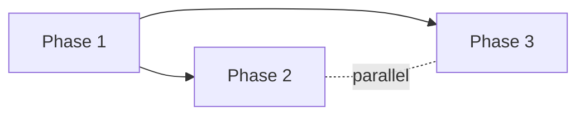

# SCOPE — <project name>

> **This is the stable backbone.** Changes to this document — premise and phase arc alike — flow exclusively through `/gabe-scope-change` (which routes to `/gabe-scope-addition` or `/gabe-scope-pivot`). Direct edits are flagged by `/gabe-commit` audit.

## 0. Reference Frame {#reference-frame}

<!-- Populated from .kdbp/scope-references.yaml. Omit this section entirely if no references are declared. -->

The following external documents framed this scoping. See `.kdbp/scope-references.yaml` for full entries.

| ID | Weight | Path | Role |
|---|---|---|---|
| ref-01 | authoritative | <path> | <one-line role> |
| ref-02 | suggestive | <path> | <one-line role> |
| ref-03 | contextual | <path> | <one-line role> |

**Conflict resolution:** Authoritative refs are hard constraints; any deviation is recorded in the Change Log below. Downgrading an authoritative ref triggers a pivot.

## 1. One-liner {#one-liner}

<The pitch in ≤25 words.>

## 2. Problem {#problem}

<What pain this solves, who feels it, evidence it matters. 3–5 paragraphs or bullets.>

## 3. Vision / North Star {#vision}

<Where this goes in 1–3 years if everything works.>

## 4. Primary User & Jobs-to-be-Done {#primary-user}

**Primary user:** <role / persona>

**Jobs-to-be-Done:**
- **When I** <context>, **I want to** <action>, **so I can** <outcome>.
- **When I** <context>, **I want to** <action>, **so I can** <outcome>.

## 5. Secondary Users {#secondary-users}

<Optional. Others who benefit; explicitly ranked below primary. Omit section if none.>

- **<Role>** — <how they benefit, why secondary>

## 6. Non-Users {#non-users}

<Explicitly NOT for these people. Mandatory — cannot be empty.>

- **<Role / segment>** — <why not for them>
- **<Role / segment>** — <why not for them>

## 7. Success Criteria {#success-criteria}

Goal-backward, observable user truths. Every criterion below is covered by ≥1 Requirement in §12.

- **SC-01** {#sc-01} — A user can <observable action> within <constraint>.
- **SC-02** {#sc-02} — A user can <observable action> within <constraint>.
- **SC-03** {#sc-03} — <...>

## 8. Non-Goals {#non-goals}

What we are explicitly NOT building, each paired with why.

### NG-01 — <short name> {#ng-01}
**Statement:** We will not <what>.
**Why:** <rationale>.

### NG-02 — <short name> {#ng-02}
**Statement:** We will not <what>.
**Why:** <rationale>.

## 9. Constraints {#constraints}

| Dimension | Constraint |
|---|---|
| Tech stack | <committed stack> |
| Budget | <monetary / token / compute> |
| Timeline | <milestone dates if fixed> |
| Regulatory | <compliance requirements> |
| Team size | <people / roles> |
| Infra | <deployment / runtime limits> |

## 10. Architecture Posture {#architecture-posture}

High-level shape only — detailed module design lives in per-phase PLAN.md files.

- **Synchrony:** <sync | async-first | mixed>
- **Topology:** <monolith | multi-agent | microservices | library>
- **Data gravity:** <local-first | cloud-first | hybrid>
- **Deployment target:** <where it runs>
- **Integration surface:** <key external APIs / systems>

<!-- ===== Custom sections (optional, per custom_sections: frontmatter) ===== -->
<!-- Custom sections appear here, between Architecture Posture and Requirements. -->

## 12. Requirements {#requirements}

Each requirement covers one or more Success Criteria. Every requirement maps to exactly one Phase in [§Phases](#phases).

### REQ-01 — <short name> {#req-01}
**Covers SCs:** [SC-01](#sc-01)
**Description:** <concrete requirement statement>
**Acceptance signal:** <how we know it's done>

### REQ-02 — <short name> {#req-02}
**Covers SCs:** [SC-01](#sc-01), [SC-02](#sc-02)
**Description:** <...>
**Acceptance signal:** <...>

<!-- Add REQ blocks as needed. Each must have a unique REQ-NN ID + {#req-NN} anchor. -->

### Coverage matrix (auto-generated)

| Success Criterion | Covered by REQs |
|---|---|
| SC-01 | REQ-01, REQ-02 |
| SC-02 | REQ-02 |
| SC-03 | REQ-03 |

Every SC must have ≥1 REQ. Finalize blocks if the matrix is incomplete.

## Phases {#phases}

<!-- Populated via /gabe-scope Step 7 (Requirements → Phase Split → Phases). Evolves via /gabe-scope-addition (phases_version bump, decimal-ID inserts) and /gabe-scope-pivot (phases_version reset, full re-derivation). Direct edits are flagged by `/gabe-commit` audit. -->

The phase arc derived from §12 Requirements. Unnumbered by design — it sits between Requirements and Strategic Risks and evolves independently of the premise sections above it.

### Granularity

- **Chosen:** standard (5–8 phases, sprint-sized)
- **Alternatives considered:** coarse (3–5, milestone-sized), fine (8–12, iteration-sized), custom

### Phase Table (at a glance)

| ID | Name | Status | Depends-on | Parallel-with | Covers REQs |
|---|---|---|---|---|---|
| 1 | <phase name> | pending | — | — | [REQ-01](#req-01) |
| 2 | <phase name> | pending | 1 | — | [REQ-02](#req-02) |
| 3 | <phase name> | pending | 1 | 2 | [REQ-03](#req-03) |

#### Status vocabulary
- **pending** — not started
- **in-progress** — at least one task checked off in per-phase PLAN.md
- **blocked** — dependency or external blocker
- **complete** — all Covers REQs satisfied; validated by `/gabe-align`
- **deferred** — moved out of the current arc (retained for audit)

#### ID conventions
- **Integer IDs** (1, 2, 3, …) are root phases from the initial `/gabe-scope` authoring.
- **Decimal IDs** (1.1, 2.3, …) are `/gabe-scope-addition` insertions between root phases.

### Phase Detail

Each phase below is deep-linkable via `{#phase-N}` anchor.

#### Phase 1 — <name> {#phase-1}

**Status:** pending
**Goal:** <goal-backward observable user truth — "By end of this phase, a user can observe X">

**Why (business intent):** <one paragraph explaining why this phase exists now in the arc; what would be broken or impossible without it.>

**Covers REQs:** [REQ-01](#req-01)
**Depends-on:** —
**Parallel-with:** —

**Exit criteria:**
- REQ-01 acceptance signal satisfied
- `/gabe-align` drift check passes
- `/gabe-review` has zero blocking items

---

#### Phase 2 — <name> {#phase-2}

**Status:** pending
**Goal:** <goal statement>

**Why (business intent):** <paragraph>

**Covers REQs:** [REQ-02](#req-02)
**Depends-on:** 1
**Parallel-with:** —

**Exit criteria:**
- REQ-02 acceptance signal satisfied
- <phase-specific criterion>

---

<!-- Add phase detail sections as needed. Each must have a unique Phase-N ID + {#phase-N} anchor. -->

### Dependency Graph

<!-- Auto-generated from Depends-on and Parallel-with columns above. Regenerated on any /gabe-scope-change. -->

### Coverage Matrix

Every REQ from [§12 Requirements](#requirements) appears in exactly one phase below. Orphans and duplicates block `/gabe-scope` finalize.

| REQ | Phase |
|---|---|
| [REQ-01](#req-01) | [Phase 1](#phase-1) |
| [REQ-02](#req-02) | [Phase 2](#phase-2) |
| [REQ-03](#req-03) | [Phase 3](#phase-3) |

## 13. Strategic Risks {#strategic-risks}

Premise-level risks only. Implementation risks live in per-phase PLAN.md files.

### SR-01 — <short name> {#sr-01}
**Risk:** <risk statement>
**Likelihood:** Low / Medium / High
**Severity:** Low / Medium / High
**Mitigation posture:** <stance, not tactics>

### SR-02 — <short name> {#sr-02}
**Risk:** <...>
**Likelihood:** ...
**Severity:** ...
**Mitigation posture:** <...>

## 14. Open Questions {#open-questions}

Unresolved items from scoping. Items marked `[UNRESOLVED — brainstorm exit]` came from the §3.5 sub-loop hitting its 2-cycle cap.

### OQ-01 — <short topic> {#oq-01}
**Question:** <question>
**Status:** open

### OQ-02 — <short topic> {#oq-02}
**Question:** <question>
**Status:** `[UNRESOLVED — brainstorm exit]`

## 15. Change Log {#change-log}

Append-only. Each entry: date, type (`init | addition | pivot | debt-scan`), summary, diff pointer (optional). Phase-arc changes (new/split/inserted phases from `/gabe-scope-addition`, or a full re-derivation from `/gabe-scope-pivot`) log here too — there is no separate phase change log. `debt-scan` entries are written by `/gabe-debt` when it appends Open Questions to §14 and/or rules to `.kdbp/RULES.md`.

| Date | Type | Summary |
|---|---|---|
| <YYYY-MM-DD> | init | Initial scope authored via `/gabe-scope`. |
